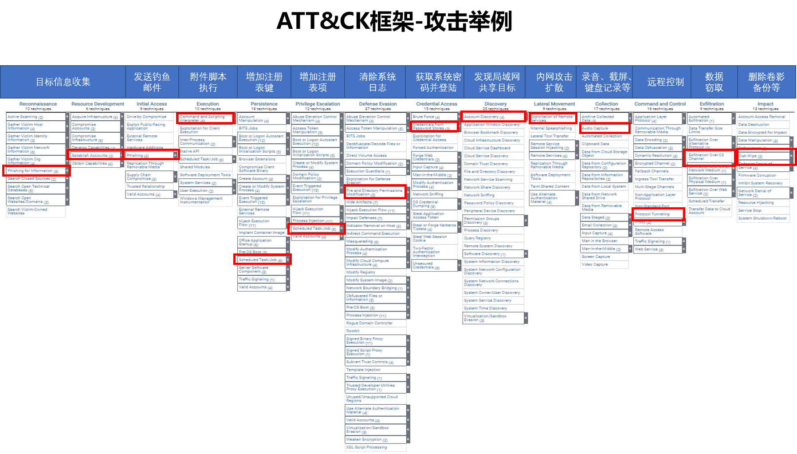
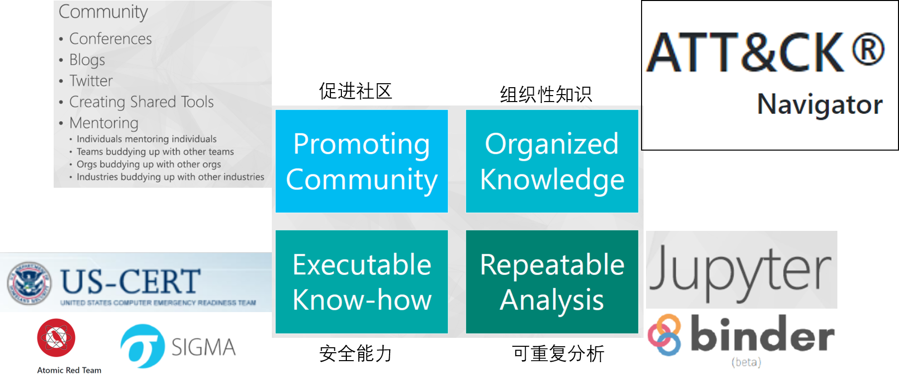

### 1.ATT&CK的缔造者-Mitre

根据某安全公司的[资料](http://www.tdhxkj.com/news/651.html)，[MITRE](https://www.mitre.org/)（麻省理工学院研究与工程组）诞生于冷战时代，其前身是麻省理工学院的林肯实验室，当时美国空军为了能够精确掌握敌军战机的来袭动态，便请求麻省理工学院帮助他们建立一个防空系统，于是建立成了研究所，并提出半自动地面环境(SAGE)，通过解和雷达、无线电和网络通信等技术来检测敌机。该研究所管理者于1958年建立Mitre公司，并管理SAGE未来发展。SAGE于1963年开始运作，通过一次次技术的融入与进步，SAGE也成为了美国第一个现代化防空系统。

　　1970进入下一个主要计划：国防部情报信息系统，至今仍在使用;

　　1990与美国联邦航空局首次合作，建立一个心得FFRDCs(军方编外研究机构);

　　2010-2014 Mitre成为三个FFRDCs的管理者;

　　至今：他们在与美国疾控中心合作，共同对抗新型冠状病毒，通过创建模型来追踪流行病，并且研发出远程医疗套件等来帮助人们对抗流行病。纵观MITRE的发展史，以对空领域为起点，横向的发展之广，捣毁过暗网市场，研究过生物科技，网络安全，研发过嵌入式入侵检测系统，抵抗过新冠病毒，参与国防建设等等，但从纵向发展来看，他们的深度依旧很深，掌握着核心技术，引领世界潮流，这就是MITRE在技术领域的庞大“帝国”。

在安全领域，代表美国研发国家队、更是美国军方的编外研究机构的Mitre建树颇多，例如大名鼎鼎的[CVE](https://cve.mitre.org/)（Common Vulnerabilities and Exposures）漏洞就所属他的麾下，除此之外还包括CWE、CPE、CAPEC、MAEC、STIX/TAXII、Cygraph、AYY&CK、Sheild等众多重要项目。今天主要介绍其中之一ATT&CK。

### 2.关于ATT&CK

[ATT&CK](https://attack.mitre.org/)首先要明确他是一个知识库，旨在从攻击者的视角归纳网络攻击行为的技战术，并为网络安全领域的威胁模型和方法论，官网上的定义如下：

**MITRE ATT&CK® is a globally-accessible knowledge base of adversary tactics and techniques based on real-world observations. The ATT&CK knowledge base is used as a foundation for the development of specific threat models and methodologies in the private sector, in government, and in the cybersecurity product and service community.**

**With the creation of ATT&CK, MITRE is fulfilling its mission to solve problems for a safer world — by bringing communities together to develop more effective cybersecurity. ATT&CK is open and available to any person or organization for use at no charge.**

笔者认为ATT&CK的主要特点主要有几点：

​	1.ATT&CK采用的是攻击者的视角，也就是说在ATT&CK的矩阵框架中所陈列的每一种技战术，都可以和现实中对应，比如永恒之蓝攻击，从扫描行为到漏洞利用，从提权操作到持久化，从C2连接到最后的造成影响，都可以在ATT&CK中找到对应的动作。我们通过某恶意软件的攻击行为举个例子（笔者个人原创，如有不准确之处欢迎发邮件指正）。

​	2.ATT&CK可以将攻击事件细化到每一个攻击动作，更新于2021年10月21日的V10.1版本的ATT&CK，包含14个战术，188个技术，以及379个自技术。其中14个战术与洛马提出的杀伤链（[syber kill chain](https://www.lockheedmartin.com/en-us/capabilities/cyber/cyber-kill-chain.html)）存在相关性，但是对APT攻击的攻击步骤从七个细化到了14个。188个技术以及379个自技术对应的都是攻击者常用的攻击动作。国内如天融信、安天等安全公司已经完成自己安全产品的威胁警告与ATT&CK之间的联动，青藤云也在自己的Threat Hunting产品中应用了ATT&CK的相关技术。

​	3.ATT&CK系统化、层次化的知识库。相比于杀伤链，ATT&CK有着更丰富的内容，比如使用者可以对自己遭受的安全攻击进行后续的分析。明确每一个攻击动作对应的技术，包括了解常用这个攻击技术的黑客组织以及攻击事件、实施这个攻击技术的恶意软件或命令、明确攻击行为的缓解措施以及防御方法、指导这种攻击技术的检测方法和反制措施等。ATT&CK还贴心的使用者提供了[ATT&CK Navigator](https://mitre-attack.github.io/attack-navigator/)这一威胁可视化工具，可以帮助被攻击者明确当前攻击态势；通过[CAR](https://car.mitre.org/))可以检测和分析安全能力，甚至通过[SHIELD](https://shield.mitre.org/)实现通过攻击行为找到防御方法的魔法秘籍。

### 3.ATT&CK的用途

根据ATT&CK的主要架构设计者之一Blake Strom在2018年发布在[Mitre](https://www.mitre.org/capabilities/cybersecurity/overview/cybersecurity-blog/attck-101)上关于ATT&CK的介绍，ATT&CK框架旨在解决四个主要问题;

第一，关注攻击者的行为，通过分析攻击者的技战术，以实现针对攻击技战术的具体检测和分析方法。攻击者可以域名、IP、HASH等表象，但是无法改变其攻击手法以及与被攻击者之间的交互方式。举例来说，一个攻击者可能会因为动态IP地址的方法常常更改其攻击源的IP地址，但是他使用的nmap扫描方法不会变。另一个攻击者可能会常常更改其僵尸网络的控制端IP地址，但是其DGA的内在逻辑不会变。

第二，杀伤链等生命周期模型因为过于概括与笼统，导致其无法具体的攻防行为相关联，基于技战术的TTPS则可以。举例来说，同样是命令与控制（C2），相比于杀伤链，ATT&CK会将其细分为包括DGA在内的16个技术。

第三，可以应用于实际环境。基于技战术的TTPS可以与具象的攻防行为建立联系，每一个技术都可见且可用。举例来说，包括端口扫描、漏洞利用、邮件钓鱼、网站水坑、暴力破解在内的常见攻击方法都可以在aTT&CK内找到对用的技术点。

第四，更加通用的排列组合，通过不同战术中的技术点，可以实现对攻击事件的具体描述。既可以描述熊猫烧香，也可以描述永恒之蓝。

ATT&CK还对具体的应用方向进行了指引，无论是关注信息安全的安全客户，还是关注提升安全能力的安全厂商，都可以通过使用ATTT&CK框架受益。ATT&CK总结了四个常见的应用场景：1.整合威胁情报；2.提高检测和分析能力；3.攻防模拟的红蓝对抗；4.安全评估与工程化应用。

### 4.ATT&CK的应用举例

微软：

微软情报中心主管John Lambert认为信息安全的持续性由一下四个部分组成，其中结构性知识分析，微软采用了ATT&CK Navigator 分析工具。

同时，微软的商用杀毒产品Defender Advanced Threat Protection (ATP)的安全告警日志类别与MITER ATT&CK框架实现映射，以便在安全告警日志中展示MITER ATT&CK框架内的Tactic、 Techniques信息。方便其Microsoft Azure Sentinel产品进行系统性分析以及ATT&CK的适配。

作为微软安全的重要产品，Microsoft Azure Sentinel是可缩放的云原生的安全信息事件管理 (SIEM) 和 安全业务流程自动响应 (SOAR) 解决方案。

在其“高级多阶段攻击检测分类”以及“通过REST API 创建和管理搜寻查询”以及“[Alerts](https://docs.microsoft.com/zh-cn/rest/api/securitycenter/alerts/list)的日志分类”以及“响应安全警报”中都采用了ATT&CK框架的Tactics以及Techniques的内容。

Crowdstrike：

Crowdstrike作为EDR与云安全的黑马独角兽安全企业，一直以Threat Graph的形式对攻击行为进行可视化展示，并作为其三个核心技术之一。与此同时Threat Graph中的具体攻击行为会与ATT&CK框架中的Tactic和Technique进行映射，提高将检测到的攻击行为进行系统性的的可视化展示。同时在MITRE ATT&CK评估中CrowdStrike Falcon优势明显，在所有19个攻击阶段检测率为100%。

### 5.ATT&CK使用的局限性

1.ATT&CK作为后来者，在应用的广泛性上与Syber Kill Chain存在明显差距，更多的安全厂商喜欢使用Syber Kill Chain作为主要手段分析攻击事件。例如笔者曾经在某一家安全公司介绍ATT&CK相关内容的时候，某资深的安全开发人员并不感冒，当讲到ATT&CK与Syber Kill Chain的关系和优劣的时候，他表示很感兴趣并希望后续了解。

2.安全能力的历史积累大部分是基于Syber Kill Chain等早期框架，因此实现与ATT&CK的关联与匹配需要很繁重的修改工作，历史的能力积累在这一刻成为了历史的包袱，且很多安全功能对应的Signature需要很资深的安全人员进行分析和修改。

3.作为一种可以梳理安全能力的知识框架，很难在有限的时间内成为利润增长点，且需要要一定的开发投入，在安全行业内卷如斯的今天，有很多为了活下去或者为了业绩增长的安全公司会认为ATT&CK食之无味，弃之可惜。

### 6.ATT&CK的前景

笔者从事网络安全行业研究五年，作为一只能力平平的老鸟，我认为ATT&CK作为梳理安全能力和结构化网络威胁的利器，未来会爆发出极大的能量。作为网络安全行业的从业人员可以不必精通，但是一定需要了解。