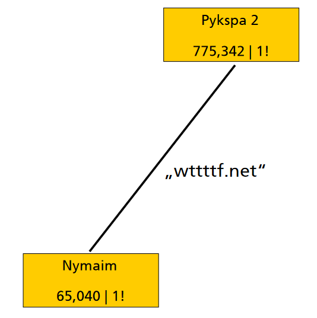

## DGA的定义

Fast-Flux僵尸网络通信所采用的域名一般被称为DGA域名，即通过特定算法随机生成的域名，是一种通过输入一些种子，包含字符串、数字、特定英文字典中的单词以及日期，利用加密算法（比如异或操作等），从而产生一系列伪随机字符串生成的域名。DGA域名是随机生成的，用于逃避域名黑名单检测技术。

DGA是英文Domain Generation Algorithm的缩写，中文翻译为域名生成算法。首先需要明确DGA指的是算法，这种算法的功能和目的就是生成域名，通过DGA生成的域名被称为AGD，英文Algorithmically-Generated Domain。根据[dgarchive](https://dgarchive.caad.fkie.fraunhofer.de/welcome/)的作者 [Daniel Plohmann](https://net.cs.uni-bonn.de/wg/cs/staff/daniel-plohmann/)2015年在第三届Botconf会议上的[报告](https://www.botconf.eu/wp-content/uploads/2015/12/OK-P06-Plohmann-DGArchive.pdf)内容，DGA最早在2008年被提出，当时被称为Domain Flux，到目前为止，DGA的家族种类已经超过70种，累计生成的域名超过1亿个。

## DGA的组成

参考绿盟的[相关研究](https://www.secrss.com/articles/14369#:~:text=DGA%E7%AE%97%E6%B3%95%E7%94%B1%E4%B8%A4%E9%83%A8%E5%88%86%E6%9E%84%E6%88%90%EF%BC%8C%E7%A7%8D%E5%AD%90%EF%BC%88%E7%AE%97%E6%B3%95%E8%BE%93%E5%85%A5%EF%BC%89%E5%92%8C%E7%AE%97%E6%B3%95%EF%BC%8C%E5%8F%AF%E4%BB%A5%E6%A0%B9%E6%8D%AE%E7%A7%8D%E5%AD%90%E5%92%8C%E7%AE%97%E6%B3%95%E5%AF%B9DGA%E5%9F%9F%E5%90%8D%E8%BF%9B%E8%A1%8C%E5%88%86%E7%B1%BB%EF%BC%8CDGA%E5%9F%9F%E5%90%8D%E5%8F%AF%E4%BB%A5%E8%A1%A8%E7%A4%BA%E4%B8%BAAGD%EF%BC%88Algorithmically-Generated%20Domains%EF%BC%89%E3%80%82,2.1%20%E6%8C%89%E7%85%A7%E7%A7%8D%E5%AD%90%E8%BF%9B%E8%A1%8C%E5%88%86%E7%B1%BB)的归纳总结，DGA主要有两部分组成，分别是种子（seed）和针对种子的DGA处理算法。通过这两个组合，DGA就可以生成AGD了。

### 种子

第一部分是种子，种子是DGA输入参数，不同的种子即使采用相同的DGA处理算法，也可以生成不同的DGA域名，这就导致DGA可以生成海量的域名。

### 算法

算法代表了DGA对种子(Seed)的处理逻辑，比如可以对seed进行逻辑运算，最后对逻辑运算的结果计算哈希值，并将哈希值作为DGA域名；同时也可以对逻辑运算的记过进行截取，并将字符串的截取结果作为DGA域名。

## DGA种子类型

一般看说，DGA的种子可以分为三种类型：

### 基于词典的种子

通过事先设定词典并通过一定的逻辑筛选其中的部分种子，通过排列组合以及逻辑操作，就可以生成DGA域名；

例如simda就是利用词典种子的DGA算法：

```
length = 7
tld = "com"
key = "1676d5775e05c50b46baa5579d4fc7"
base = 0x45AE94B2

consonants = "qwrtpsdfghjklzxcvbnmv"
vowels = "eyuioa"

step = 0
for m in key:
    step += ord(m)

for nr in range(1000):
    domain = ""
    base += step

    for i in range(length):
        index = int(base/(3+2*i))
        if i % 2 == 0:
            char = consonants[index % 20]
        else:
            char = vowels[index % 6]
        domain += char

    domain += "." + tld
    print(domain)
```

### 基于时间的种子

DGA算法可以将时间信息作为输入种子，通过感染主机的系统时间、HTTP的响应时间，以及其他控制与被控端可以同时明确的时间都可以作为输入，生成对应的DGA域名；

例如ranbyus家族就是利用时间为主要种子并结合字典种子的DGA家族：

```
"""
    The DGA of Ranbyus as described here:
        http://johannesbader.ch/2015/09/ranbyuss-dga-revisited/
    Known Seeds are:
        - 0F0D5BFA
        - F2C72B14
        - AE8714BE
        - CE7F8514 (= ~ 31807AEB)
        - 572473BB (= ~ A8DB8C44)
        - 17794CF1 (= ~ E886B30E)
        - C0E32524 (= ~ 3F1CDADB)
        - 7CB7966E (= ~ 83486991)
        - 9F90C9E7 (= ~ 606F3618)
        - 8FB8879B (= ~ 70477864)
        - E981684B (= ~ 167E97B4)
"""

import argparse
from datetime import datetime

def to_little_array(val):
    a = 4*[0]
    for i in range(4):
        a[i] = (val & 0xFF)
        val >>= 8
    return a
        
def pcg_random(r): 
    alpha = 0x5851F42D4C957F2D
    inc = 0x14057B7EF767814F

    step1 = alpha*r + inc
    step2 = alpha*step1 + inc
    step3 = alpha*step2 + inc
    
    tmp = (step3 >> 24) & 0xFFFFFF00 | (step3  & 0xFFFFFFFF) >> 24
    a = (tmp ^ step2) & 0x000FFFFF ^ step2
    b = (step2 >> 32)
    c = (step1 & 0xFFF00000)  | ((step3 >> 32) & 0xFFFFFFFF) >> 12
    d = (step1 >> 32) & 0xFFFFFFFF
    
    data = 32*[None]
    data[0:4] = to_little_array(a)
    data[4:8] = to_little_array(b)
    data[8:12] = to_little_array(c)
    data[12:16] = to_little_array(d)
    return step3 & 0xFFFFFFFFFFFFFFFF, data

def dga(year, month, day, seed):
    x = (day*month*year) ^ seed
    tld_index = day
    for _ in range(40):
        random = 32*[None]
        x, random[0:16] = pcg_random(x)
        x, random[16:32] = pcg_random(x)

        domain = ""
        for i in range(17):
            domain += chr(random[i] % 25 + ord('a'))
        if seed == 0xCE7F8514:
            tlds =  ["in", "net", "org", "com", "me", "su", "tw", "cc", "pw"]
        else:
            tlds =  ["in", "me", "cc", "su", "tw", "net", "com", "pw", "org"]
        domain += '.' + tlds[tld_index % (len(tlds) - 1)]
        tld_index += 1
        yield domain

if __name__=="__main__":
    parser = argparse.ArgumentParser()
    parser.add_argument("-d", "--date", help="date for which to generate domains")
    parser.add_argument("-s", "--seed", help="seed as hex string", default="0F0D5BFA")
    args = parser.parse_args()
    if args.date:
        d = datetime.strptime(args.date, "%Y-%m-%d")
    else:
        d = datetime.now()
    for domain in dga(d.year, d.month, d.day, int(args.seed, 16)):
        print(domain)
```

### 基于其他动态数据的种子

比如Bedep是以欧洲中央银行每天发布的外汇参考汇率作为种子，Torpig使用twitter的关键字作为种子，这些动态变化的数据只有在确定的时间窗口内注册域名才会生效；

例如在[Bedep的python实现](https://github.com/arbor/bedep_dga/blob/b6aff6b9cbcabb32514e2afab35ad939c610d5a6/dga.py#L133)中就有这两行代码，代表采用欧中中央银行的相关信息：

```
cube1 = root.find("{http://www.ecb.int/vocabulary/2002-08-01/eurofxref}Cube")
cube2s = cube1.findall("{http://www.ecb.int/vocabulary/2002-08-01/eurofxref}Cube")
```

## DGA的类别

### 基于种子类型的分类

通过Thomas Barabosch等人对DGA的[分析论文](https://net.cs.uni-bonn.de/fileadmin/user_upload/wichmann/Extraction_DNGA_Malware.pdf)中，的信息我们可以看出，有的种子是固定的，比如字典或者某一个固定的时间；有些种子是跟随时间动态变化的不可确定的种子。那么因此根据这种特性DGA域名可以分为四类：

#### TID

TID（time-independent and deterministic），与时间不相关，可确定。主要以基于词典的种子为主；

#### TDD

TDD（time-dependent and deterministic），与时间相关，可确定；以基于时间的种子为主，同时也会应用基于词典的种子；

#### TDN

TDN（time-dependent and non-deterministic），与时间相关，不可确定；以基于其他动态数据的种子为主，同时会应用基于词典的种子。

#### TIN

TIN（time-independent and non-deterministic），与时间不相关，不可确定；目前未发现相关DGA家族，笔者也不知道和时间不相关的种子有哪些。

Daniel Plohmann在[技术分享](https://www.botconf.eu/wp-content/uploads/2015/12/OK-P06-Plohmann-DGArchive.pdf)中，对多个DGA家族在基于种子类型分类中的统计情况如下：


### 基于算法生成方式的分类

#### Arithmetic (A)

算数算法，这种算法主要是对通过四则运算和逻辑运算等方法对seed进行处理。生成的域名可读性较差。

示例DGA家族：DirCrypt

示例DGA域名：vlbqryjd.com

#### Wordlist (W) 

词根算法，这种算法主要是通过四则运算和逻辑运算等方法生成索引，并索引词表中的词根生成域名，这种域名有一定的可读性，很难被检测，但是域名长度较长，并且比较容易发生DGA域名碰撞。

示例DGA家族：Matsnu

示例DGA域名：termacceptyear.com

#### Hashing (H)

哈希算法，通过hash的方法对seed进行处理，通过HASH散列的方法随机生成域名，这种域名没有可读性，并且长度固定，容易被检测，不容易发生DGA域名碰撞。

示例DGA家族：Bamital

示例DGA域名：b83ed4877eec1997fcc39b7ae590007a.info

#### Permutation (P) 

与词根算法有些类似，但是这种方法是很容易被穷举。

示例DGA家族：VolatileCedar

示例DGA域名：dotnetexplorer.info

对多个DGA家族在基于算法生成方式分类中的统计情况如下：


## DGA的用途

DGA的主要用于被恶意控制的被控端与黑客的控制端之间的C2通信。完成整个C2通信主要分为以下几个步骤：

​	step1：黑客在DGA生成的大量域名中找一个进行域名XXX.biz注册；

​	stdp2：被控端查询DGA生成的域名，通过查找碰撞找到域名XXX.biz对应的IP地址；

​	step3：通过连接IP地址向被控端服务器发送保活包并接受C2命令.

在这个工程中，第一、因为DGA生成的域名具有很强的伪随机性且随着时间和seed等信息不断变化，因此很难通过黑名单的方法进行拦截；第二、而且通过提前注册DGA生成的域名，就可以将IP地址隐藏起来，降低IP地址被黑名单拦截的风险。第三、DGA生成算法可以进行不断的更新迭代，通过嵌入特定的英文单词作为seed，域名看上去更加正常且具备一定的语义信息，提高了检测难度。

## DGA的破绽

虽然DGA算法可以规避黑名单等检测方法，但是由于其独特的生成方法和DNS查询特点，还是存在明显的破绽。第一点就是每一次DGA会生成多个DGA域名，因此在这个过程当中会产生多于正常时候的NXDomain类型的DNS查询次数；

第二，因为DGA生成的域名的主要作用就是为了找到控制端对应的IP地址，因此DGA生成的域名地址很少还会有子域名，域名的级数和子域名的个数都较少；

第三，相比于正常域名DGA域名的长度更长，可读性相对较差。

第四，鉴于用户的上网习惯，一般常用的DNS查询都会历史记录，但是DGA很可能是初测注册，因此大概率会是首次出现的DNS查询；

第五，DGA生成的域名一般临时快速注册的，因此注册时间和被控端DNS查询之间的时间差会很短；

第六，DNS的存活时间很短，一般是在1到7天。

以上的这些特点都可以通过不同的检测方法进行针对性的检测。其中包括机器学习的方法、异常检测的方法、以及阈值和正则的方法、以及DNS查询记录分析和Whois查询等多种方法。安全厂商可以根据不同安全产品的数据和计算能力，进行针对性分析。

## DGA的检测方法

DGA作为C2连接行为的前期行为，可以根据C2服务器的特点采用传统检测方法进行检测。从DGA中算法的角度来说，因为这种域名很少重复使用，因此比较适合采用智能检测方法进行检测。

### 传统检测方法

#### 威胁情报

DGA行为的主要目的是为了找到C2服务器的IP地址，因此可以将C2服务器的IP地址作为威胁情报进行检测，并根据威胁情报检测结果对C2行为进行拦截以及Theat Hunting的处理。

#### 根于域名注册信息分析

一般DGA的域名注册时间和当前DNS查询行为之间的时间差比较短，并且DGA域名可用的时间也比较短，一般小于一周。

举例来说我们查询baidu.com的时候会发现域名开始注册的时间与当前查询时间的时间差可能是十几年。而DGA域名的注册时间和当前查询时间的时间差可能只有几天。

### 智能检测方法

#### 机器学习算法

可以采用统计分析特征的传统机器学习算法和RNN的深度学习算法进行检测。**需要注意的是采用机器学习算法进行DGA检测时，基于家族的DGA多分类算法一般准确率不会过高，如果在测试集下的量化指标过于出色，那么就需要注意模型的过拟合问题！！！！！！**

这是为什么呢？因为很多同类别的DGA家族之间就存在明显的碰撞问题，根据Daniel Plohmann的研究,发现以下家族之间就存在明显的碰撞行为：


同时还有：




##### 传统机器学习

从传统机器学习算法的样本输入的角度来说，可以以一个域名作为输入，也可以以N个域名作为一个样本输入。相比于一个域名的输入，N个域名的样本输入可以获得更多的统计信息，检测效果也更为准确。一个域名的输入可以进行实时检测，N个域名的样本输入有一定的延时特性。

##### 深度学习

采用RNN的方法可以免去统计分析归纳特征的过程，域名的字符信息可以通过embedding后直接输入到模型当中，简化了特征处理的过程。如果数据量较大时，这种方法会有很好的结果。如果数据规模不足可能会引出捷径学习和数据偏差的问题。

#### 数据分析算法

可以通过社区发现的方法对DNS查询记录进行分析，同时也可以记录一定时间窗口内的域名查询信息，并对新出现的域名进行重点分析，其中NXDomain类型的DNS也需要重点分析。

#### 基线和阈值的方法

一般会通过基线和阈值的方法作为补充以降低智能检测方法的误报，并提高检测效率。