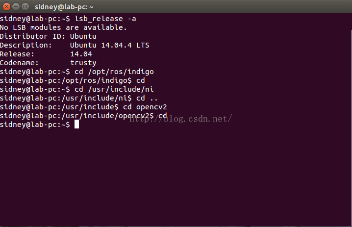

### 1.操作系统与软件版本

本实验使用Ubuntu14.04的64bit版本，ROS使用Indigo版本，图像获取使用OpenNI1(因为OpenNI2中未找到彩色图像和深度图像对齐功能，台湾的一代大神Heresy已经实现这一功能，但是我更喜欢OpenNI1官方对齐方法)，图像处理使用OpenCV2，因其更好的通用性。


### 2.配置OpenNI

openni的配置参考链接中的blog，根据功课教程可以提取Kinect的彩色图像和深度图像：

[http://www.20papercups.net/programming/kinect-on-ubuntu-with-openni/](http://www.20papercups.net/programming/kinect-on-ubuntu-with-openni/)

### 3.安装OpenCV2

首先在OpenCV2的官方网站选择对应版本的源代码：

[http://opencv.org/downloads.html](http://opencv.org/downloads.html)

同时安装依赖：

```
sudo apt-get install build-essential libgtk2.0-dev libjpeg-dev libtiff4-dev libjasper-dev libopenexr-dev cmake python-dev python-numpy python-tk libtbb-dev libeigen2-dev yasm libfaac-dev libopencore-amrnb-dev libopencore-amrwb-dev libtheora-dev libvorbis-dev libxvidcore-dev libx264-dev libqt4-dev libqt4-opengl-dev sphinx-common texlive-latex-extra libv4l-dev libdc1394-22-dev libavcodec-dev libavformat-dev libswscale-dev
```

当依赖安装完成后，安装OpenCV,首先解压OpenCV压缩包并进入OpenCV目录，进行如下操作：

```
mkdir build
cd build
cmake ..
make
sudo make install
```

### 4.安装ROS

安装ROS可以参考[ROS官网的安装教程](http://wiki.ros.org/kinetic/Installation)，由于ROS的版本更新速度较快，在ROS的Groovy版本之后，ROS采用catkin来取代之前的rosbuild的包编译方式,但总体上来说是对CMake的又一层封装.因此不必担心，如果熟悉CMake可以使用他来编译ROS，ROS的一些功能包的接口可能会因为版本变化而发生变化,需要注意。

### 5.获取kinect的彩色图像和深度图像

使用ROS自带的Package获取彩色图像和深度图像，可以参考古月居的blog：

[http://www.guyuehome.com/262](http://www.guyuehome.com/262)

使用OpenNI获取获取深度图像和彩色图像可以参考另一篇博客:

[https://www.cnblogs.com/tornadomeet/archive/2012/10/01/2709851.html](https://www.cnblogs.com/tornadomeet/archive/2012/10/01/2709851.html)

