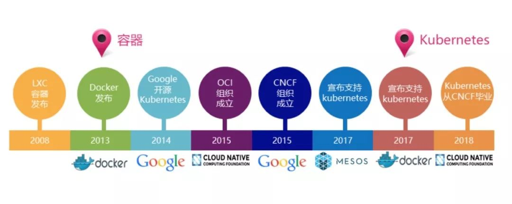

### 云原生的起源

2010年云原生的英文概念（Cloud Native）最早由Paul Fremantle 的[一篇博客](http://pzf.fremantle.org/2010/05/cloud-native.html)中被提出，他一直想用一个词语来表达一种架构，就是可以描述应用程序、中间件等服务可以再云环境中良好的运行状态，因此他总结出了Cloud Native必须包含的属性，只有满足这些属性并且保证良好的运行状态，当时提出的云原生的概念是为了构建一种符合云计算特性的标准来指导云原生的服务应用的设计和编写。

2013年Matt Stine在[推特](https://dzone.com/articles/cloud-native-devops-your-world-to-new-possibilitie)上迅速推广云原生的概念，并在2015年出版书籍《迁移到云原生架构》，并在书中定义了符合云原生架构的特征：12因素、微服务、自服务、基于API协作、抗脆弱性等特点。由于这本书的畅销，让很多人对云原生有了初期的概念，同时云原生也被12要素变成了抽象的概念。Matt Stine服务架构在迁移到云原生的过程中，需要文化、组织、技术的共同变革。其实云原生可以理解为是一种设计架构，其最大的特点是高效的可迁移性和云端可运行性。

2015年Linux基金会发起了一个The Cloud Native Computing Foundation（[CNCF](https://www.cncf.io/)） 基金组织，该组织的成立标志着云原生进入高速发展的时代。与此同时Google、Docker等巨头看到了云原生的巨大潜力纷纷加入，并逐渐围绕云原生构建具体的工具，这也让原来概念性的云原生逐渐成熟变成具象可用的云原生。在开始CNCF对于云原生的定义相对狭义，主要将其定义为容器封装化+自动化管理+面向微服务的形式。这种定义方式虽然比较狭义，但是也是在当时可用框架下，具有高可实现性的方案（The CNCF defines “cloud-native” a little more narrowly, to mean using open source software stack to be containerized, where each part of the app is packaged in its own container, dynamically orchestrated so each part is actively scheduled and managed to optimize resource utilization, and microservices-oriented to increase the overall agility and maintainability of applications.）。

同时CNCF基金会当时的拳头软件是K8s,因此在概念定义上也会围绕容器编排的方式捡了起来的生态。

2017年，云原生应用提出者之一的Pivotal在[官网](https://pivotal.io/cloud-native)上将云原生的定义概括为DevOps、持续交付、微服务、容器斯塔特征，这也成了很多人对Cloud Native的基本印象。

### 云原生的定义

2018年，随着Service Mesh 的加入，CNCF 对云原生的[定义](https://github.com/cncf/toc/blob/master/DEFINITION.md)发生了改变，而这也逐渐成为被大家认可的官方定义：

Cloud native technologies empower organizations to build and run scalable applications in modern, dynamic environments such as public, private, and hybrid clouds. Containers, service meshes, microservices, immutable infrastructure, and declarative APIs exemplify this approach.

These techniques enable loosely coupled systems that are resilient, manageable, and observable. Combined with robust automation, they allow engineers to make high-impact changes frequently and predictably with minimal toil.

The Cloud Native Computing Foundation seeks to drive adoption of this paradigm by fostering and sustaining an ecosystem of open source, vendor-neutral projects. We democratize state-of-the-art patterns to make these innovations accessible for everyone.

对定义进行概括分析：

1.基于容器、服务网格、微服务、不可变基础设施和声明式API构建弹性可拓展的应用；

2..基于自动化及时构建高容错性、易管理、易可视化的解耦合的系统；

3.构建一个开源的云技术生态，将服务和云计算服务解耦，提高服务的可移植性。

可以看出CNCF关于云原生的定义从原版的基础上加入了服务网格和声明式API，这是一种对云原生应用的丰富。服务网格可以将服务本身在框架设计时实现解耦，将一个复杂的服务设计成多个解耦后的子服务，形成服务网格，而在服务网格内部，解耦后的自服务就不会出现牵一发而动全身的尴尬，通过自服务的更新迭代，实现整个服务的迭代。声明式API让服务内部的子服务之间以及服务对外的API都有了统一标准。这就实现了通过云原生对服务架构的升级优化。

总结来看云原生的概念定义经过了三个阶段：

第一阶段：基于容器、服务网格、微服务、不可变基础设施和声明式API构建的可弹性扩展的应用；

第二阶段：基于自动化技术构建具有高容错性、易管理和便于观察的松耦合系统。

第三阶段：构建一个统一的开源云技术生态，实现服务和云计算厂商的服务解耦，通过服务的高可移植性打破云计算厂商的服务垄断。

### 云原生的解构

对于一个定义的理解，除了通过历史背景和发展历程，也可以通过语言的字面意思进行理解。Cloud Native可以拆解为Cloud和Native，也就是云计算和土著的意思，这体现了云原生对云计算的亲和力。第二层要从 Native 来看，云原生和在云上跑的传统应用不同。一些基于公有云搭建的应用是基于传统的 SOA 架构来搭建的，然后再移植到云上去运行，那么这些应用和云的整合非常低。而云原生可以通过微服务或者Serviceless将整个服务框架或者函数拆分为一个个耦合度极低的松耦合系统，天然具备分布式设计的属性，这也是Native的表现。

以上三节内容主要参考文章《[什么是云原生？聊聊云原生的今生](https://mp.weixin.qq.com/s?__biz=MzUzNzYxNjAzMg==&mid=2247500301&idx=1&sn=3272b93ca11382d8f3075b9d316b2143&chksm=fae6c9c2cd9140d44a53cbf70c5f35300475538ada2fdea09defc4a364e6e35b23f0114f75f0&token=961297874&lang=zh_CN)》。

### 云原生的十二因素

12因素是云原生框架的模式结合，这些模式可以解释什么样的应用才是云原生应用。在12因素的北京中，应用指的是可与独立部署的单元模块，将多个独立部署的单元模块进行协作就可以组合成一个应用。

1.基准代码，一份基准代码多份应用，可以通过git或者svn实现代码管理，别切有明确的版本信息和版本分支。

2.显示声明依赖，例如python的应用就可以通过指定requirement明确依赖。

3.环境中存储配置，例如每个微服务对应的容器都有自己的配置环境。

4.后端服务：把后端服务当作附加资源。后端服务是指程序运行所需要的通过网络调用的各种服务，如数据库（MySQL、CouchDB）、消息/队列系统（RabbitMQ、Beanstalkd）、SMTP 邮件发送服务（Postfix），以及缓存系统（Memcached）。

5.构建、发布、运行：严格分离构建和运行。例如在测试一个微服务的新版本时候，可以通过镜像同一个RestAPI实现对新版本的调试，并且不会影响现有版本的使用。

6.进程，以一个或多个无状态进程运行应用，如果存在状态，应该将状态外置到后端服务中，例如数据库、缓存等。

7.端口绑定，通过端口绑定提供服务，应用通过端口绑定来提供服务，并监听发送至该端口的请求。

8.并发，通过进程模型进行扩展，扩展方式有进程和线程两种。进程的方式使扩展性更好，架构更简单，隔离性更好。线程扩展使编程更复杂，但是更节省资源。

9.易处理，快速启动和优雅终止可最大化健壮性，只有满足快速启动和优雅终止，才能使服务更健壮。

10.开发环境与线上环境等价，尽可能保持开发、预发布、线上环境相同。

11.日志，把日志当作事件流，微服务架构中服务数量的爆发需要具备调用链分析能力，快速定位故障。

12.管理进程，把后台管理任务当作一次性进程运行，一些工具类在生产环境上的操作可能是一次性的，因此最好把它们放在生产环境中执行，而不是本地。

### 云原生的四要素

这一章节主要介绍云原生架构的关键技术点，其中设计云原生概念中的一些主要特征点，相关概念都是基本介绍，深入了解需要对各个关键技术进行深度学习。

#### 微服务

作为微服务的两个定义者Martin Fowler 与 James Lewis 共同提出了微服务的概念，定义了微服务架构是以开发一组小型服务的方式来开发一个独立的应用系统，每个服务都以一个独立进程的方式运行，每个服务与其他服务使用轻量级（通常是 HTTP API）通信机制。

微服务作为云原生的最基础的原子组成部分，可以看成是围绕整体服务框架构建的模块化子服务。同时微服务会使用最小规模的集中管理能力（主要是Docker）来实现各个自服务的独立运行环境。

**微服务的优势**

1.敏捷开发，减少开发成本，通过用户体验快速反馈并优化服务能力

2.持续更新，通过更加解耦的方式更新服务中的脆弱点

3.服务设施即代码（Infrastructure As Code），简化服务设备环境的管理和服务成本

**微服务的劣势**

1.受限于应用场景，对于硬件资源有限、实时高性能计算、不对外发布服务等应用场景下不建议使用微服务；

2.受限于硬件基础框架，由于Docker等容器服务对基础架构的要求，微服务的应用也会受限于硬件基础架构。

**什么时候使用微服务**

1.当一个服务的架构过于庞大和复杂的时候，微服务框架可以将复杂框架解耦为多个微服务。

2.服务框架中部分功能和组件有需要更新或更换的可能，比如数据库的更换；

3.服务在对外开放后，有很高的稳定性需求，并且需要在不影响用户使用体验的情况进行服务迭代更新。

#### 容器化

当前在云原生框架中应用最广泛的就是Docker容器引擎。自2013年Docker正式发布之后，经过近十年的发展，目前其应用范围、社区文化以及完善度都是容器领域的执牛耳者。docker是基于LXC技术开发的，因此对服务有很好的兼容性。

容器化为微服务提供实施保障，具体来说容器化可以帮助微服务更加的独立，让微服务配置依赖和更新优化等方面更加的方便快捷。同时容器技术还可让位服务更加的独立，实现应用的微服务隔离。

K8S是容器编排系统，K8s可以实现对容器的家监控、管理、负载均衡等多种功能。该编排系统由谷歌搞开发。而且Docker和K8S都是用Go语言编写的，这让二者有极好的共用性。

#### DevOps

DevOps是开发(development)和运维(operation)和组合词。DevOps相比于微服务和容器等具体的开发组件，DevOps更像时对云原生的一种特征描述，在云原生的应用场景中，开发和运维不再割裂。通过微服务和容器化的技术可以实现开发和运维的有机结合。

同时DevOpshai还包括测试，DevOps作为一种敏捷开发的应用方式，可以实现从应用开发的层面对组织形式的优化。让敏捷开发在面对复杂应用设计时存在的效率问题得到优化，这种高效的组织形式也为云原生提供了持续交付的能力。

#### 持续交付

持续交付是DevOps的外在体现，持续交付是指可以实现开发与更新交付可以同时进行。通过不断的更新实现服务的模块化组件更新，并且不会影响整体服务质量，并且不会受限于服务架构之间的耦合关系。持续交付的方法相比于传统的开发方法存在明显的优势。

同时因为持续交付要求开发版本和稳定版本共存，因此需要更多的支撑工作，但是对于服务的更新作用，这些要求是非常可以接受的。

