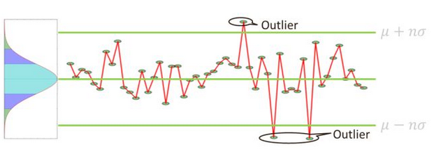
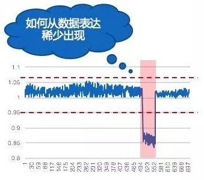
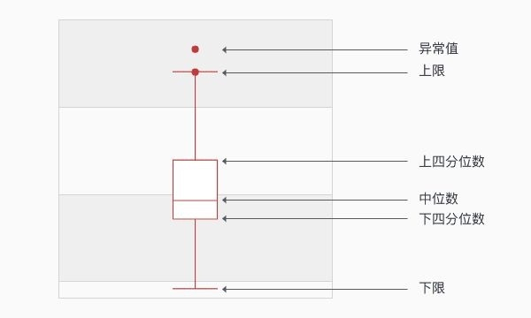
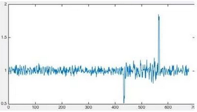
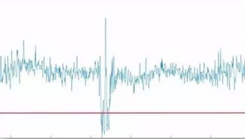
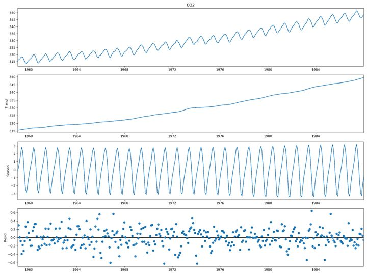
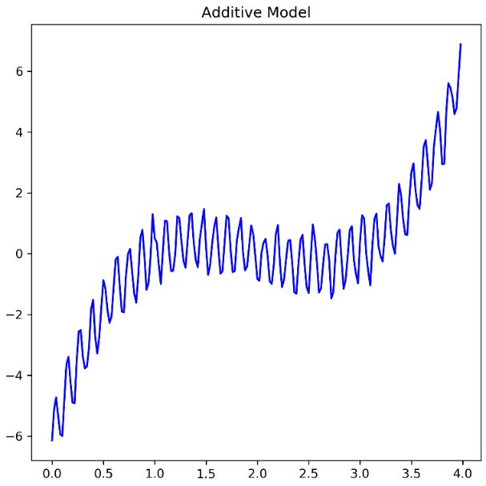
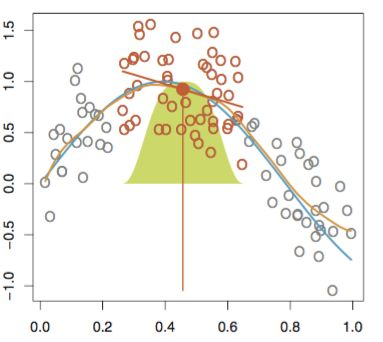
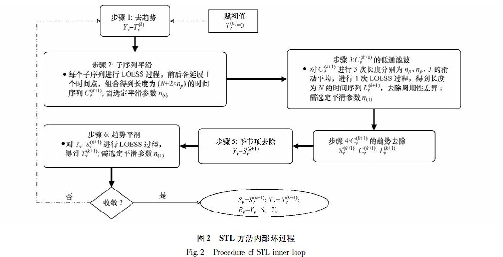

# 异常检测的定义

异常检测（anomaly detection），从定义而言就是一种识别不正常情况与挖掘非逻辑数据的技术，异常点也被叫作outliers。在数据挖掘中，异常检测对不匹配预期模式或数据集中其他项目的项目、事件或观测值的识别。异常点也被称为离群值、新奇、噪声、偏差和例外。

异常有很强的场景属性，也就是说只有在具体的场景下才能明确异常，当脱离一个场景进入另一个场景下，之前的“异常”可能就不再被认为是异常了。因此我们需要对异常进行进行归纳分类。

# 异常的种类

由于定义异常需要以具体的场景为基础，因此场景的种类多种多样。

## 时域异常

时序异常一个最大的特点就是在时间上有序列性的特点，可以是一条按照时间推进的曲线，例如股票的价格；也可以是按照时间推进的动作点，比如把大象装进冰箱总共分为几步，虽然看起来没有明显的时序关系，但是由于存在动作先后顺序关系，因此也可以看所示时序信息。

无论是连续还是离散，都展现出在时序的特点。而是否时序或者前后顺序上的存在关联，是区分时域和非时域的重要指标。小勇由于在生活中经历很多，因此时序异常很是了解。

### 时域连续异常

时序连续异常指的是在时序上存在先后关系，并且信号还是连续的或者说时序内信号是非常稠密的。

#### 单个时序连续信号

单个连续信号指的是通过一条连续的时序曲线来判断是否存在异常。

##### 平稳曲线异常检测

在这种场景下，曲线存在很小的波动，但是大小很稳定，全局的变化明显小于异常变化。具体描述为下图所示：

在上图中，正常数据一般都在0附近，只有在10:00之后出现了明显的异常。这种异常一般比较容易检测，一般通过单点恒定阈值或者累计平均阈值的方法就可以进行检测。

###### 单点恒定阈值

其中单点恒定阈值的公式如下：
$$
S(t)=
\begin{cases}
v_t>v_{max}, & \text {上限异常}\\
v_{min}\leq v_t\leq t_{max}, & \text {正常}\\
v_t<v_{min}, & \text {下限异常}
\end{cases}
$$

###### 累计平均阈值

累计平均阈值不是一个固定的值，而是对过去一定时长内的信息进行采样并取平均值：

上限阈值为：
$$
v_{max}=\lambda_{max}\frac{v_{t-n}+v_{t-n}+v_{t-n+1}+...+v_{t-2}+v_{t-1}} {n}
$$
下限阈值为：
$$
v_{min}=\lambda_{min}\frac{v_{t-n}+v_{t-n}+v_{t-n+1}+...+v_{t-2}+v_{t-1}} {n}
$$
处理单点毛刺引起的异常误报，可以将当前值换成一个短时间窗口内的平均值，举例来说可以认为$v_t$是一分钟内信号的平均值，

在数学上也可以将其理解为对过去一定时长进行积分，并将积分结果除以取值范围，以上公式的结果与数学方法近似。需要注意的，这种方法在计算是需要剔除时长范围内的异常值。

###### n-sigma方法计算阈值

该方法可以作为阈值提取和计算的一种方法，其主要准则基于目标分布是正态或近似正态分布，一般地，选取n=3。并将数值大于3$\sigma$和小于3$\sigma$的认为是异常，并将其作为上限阈值和下限阈值。当数据分布与真实分布存在一定偏差时，需要对阈值进行补偿或者放宽。

样本取值几乎全部(99.7%)集中在$(\mu-3\sigma,\mu+3\sigma)$区间内，其中：
$$
\mu=\frac{1}{N}\sum_{i=1}^Nx_i\\
\sigma=\sqrt{\frac{1}{N-1} \sum_{i=1}^N(X_i-\mu)^2}
$$
超出这个范围的可能性仅占不到0.3%，可以认为是小概率事件。因此，检测的方法也比较简单，图像展示如下：

###### ECDF计算阈值

一般来说在数据中，异常是很少出现的，具体来说如下图所示：

我们对展示数据计算经验累积概率分布曲线(ECDF)，对数据的分布进行展示：

我们可以发现10%最有的数据可以认为是异常的，这时阈值可以设定为0.98.

###### boxplot阈值计算方法

为了降低异常点的影响，boxplot准则被提出。boxplot(箱线图)是一种用作显示一组数据分散情况的统计图，经常用于异常检测。BoxPlot的核心在于计算一组数据的中位数、两个四分位数、上限和下限，基于这些统计值画出箱线图。

记 $Q1$、$Q3$分别表示一组数据的下四分位数（75%）和上四分位数（25%），则：
$$
IQR=Q3-Q1\\
THD_{max}=Q3+1.5*IQR\\
THD_{min}=Q1-1.5*IQR
$$
根据上面的统计值就可以画出下面的图，超过上限的点或这个低于下限的点都可以认为是异常点。

从上面的计算上可以看出，boxplot对异常点是稳健的。

##### 平稳曲线突升突异常检测

这种曲线的正常情况也是较为平稳的，没有周期性波动或者比较剧烈的波动。突升突降指的是在某一个时间点数值激增到一个异常范围并持续一定时间后再回复正常的这种情况，也就是说全局变化大于异常变化。具体如下图所示：

###### 空间转换

在这种场景下，一般采用空间映射的方法，将当前的数据转化到另一个表达空间。空间变换（映射）的方法如下：
$$
r_w(t)=\frac{v_{t}+v_{t-2}+...+v_{t-w-1}+v_{t-w+1} }
{v_{t-w}+v_{t-w-1}+...+v_{t-2w+2}+v_{t-2w+1} }
$$
经过空间变换之后的曲线如下，正常值应在1附近，异常值就很容易检测了：

##### 周期平稳曲线异常检测

在当前场景下，周期性曲线非常平稳，也就是说各个周期之间的重合度非常好，没有明显漂移和变化的情况，在这种情况具体如下图所示：

具体来说就是周期内每一个固定时间点都和历史信息非常相似。对于这种异常我们对周期内每个点都看作是正太分布，并通过分布情况进行分析，主要的检测方法还是空间转换。

对于周期性数据需要进行判断，一般可以将周期设置为1天或者1周，并根据计算方差判断当前数据是否为周期平稳曲线。

###### 空间转换方法

在空间转换之前，异常数据如下图所示，其中绿色为线条为上一个周期的数据，红色线条为周期的平均数据，蓝色线条为当前周期内的数据。

我们将周期内的每个时间点都认为是正太分布，因此可以通过均值和方差信息进行空间转换，转换公式如下：
$$
z(t)=\frac{x_t-\text{mean}(x_{t-kT-w}:x_{t-kT+w} ) }
{\text{std}(x_{t-kT-w}:x_{t-kT+w } ) }
$$
其中$x_{t-kT-w}:x_{t-kT+w}$表示在过去$k$个周期内第$t$个时间点前后的$2w$个数据。

空间转换后的曲线形式如下图所示：

最后可以通过阈值的方法对空间转换之后的数据进行异常检测。

##### 时间序列分解

###### ADF稳定性测试

在统计学中 Augmented Dickey–Fuller test 用于检测时序数据的平稳性和周期性检测方法，其原假设为时序存在单位根，并计算满足该假设的 p 值， 如果 p 值过小，则否定原假设——时序数据不存在周期性。具体方法如下：

创建回归模型，对时序数据进行拟合，模型的具体方程为： $$ \Delta y_{t}=\alpha+\beta t+\gamma y_{t-1}+\delta_{1} \Delta y_{t-1}+\cdots+\delta_{p-1} \Delta y_{t-p+1}+\varepsilon_{t} $$

进行单位根检验，计算DF值： $$ D F_{\tau}=\frac{\hat{\gamma}}{S E(\hat{\gamma})} $$ 并将DF值与 Dickey–Fuller Test 的值相比较，如果 DF 值小于比较值，则否定原假设，数据不存在周期性。

**ps**： ADF test 不支持含有趋势性的时序数据检验，因此在检测前必须去除趋势性

实现[Python]: [statsmodels.tsa.stattools.adfuller](https://www.statsmodels.org/stable/generated/statsmodels.tsa.stattools.adfuller.html)

一个时间序列信号一般可以分为长期趋势、季节周期、不规则波动等几个部分组成，因此可以将信号分解为这几种变量的组合，或者说这些组合部分综合在一起组成了一个实际的时序信号。我们可以结合二氧化碳排放的数据进行展示：

其中第一个子图为1960年到1984年二氧化碳排放的数据；

第二个子图为趋势部分，展示二氧化碳排放逐年增多的趋势；

第三个子图为周期部分，展示了二氧化碳在内一年内排放的周期性特点；

第四个子图为残差部分，展示了二氧化碳排放的不能解释的部分，也就是随机性的数据特点；

###### 经典时间序列分解

经典时间序列分解法起源于20世纪20年代。它的步骤相对简单，它是很多其他的时间序列分解法的基石。这种组合关系可以是加法组合也可以是乘法组合。其中加法组合关系如下：
$$
Y(t)=T(t)+S(t)+R(t)
$$
乘法组合关系如下：
$$
\log(Y(t))=\log(T(t))+\log(S(t))+\log(R(t))
$$

其中加法模型的使用场景如下：

乘法模型的使用场景如下：

当我们不明确需要使用哪一种模型的时候，可以同时使用两个模型，并选择误差最小的那个模型。

我们以加法分解算法流程举例（乘法流程和加法流程相似，就是把减法运算更换为除法运算），计算过程如下：

step1:计算趋势序列，假设周期$m$是一个奇数，并设计一个数值$k$，使$m=2k+1$，则趋势部分的估计值可以通过$m$阶滑动平均$m-MA$的计算公式如下：
$$
\hat T_t=\frac{1}{m}\sum_{j=-k}^{k} y_{t+j}
$$
当m为偶数的时候，趋势部分可以采用2阶滑动平均（2-MA）的计算公式计算获得，计算公式如下：
$$
\hat T_t=\frac{1}{2m}(\sum_{j=-m+2}^{1} y_{t+j}+\sum_{j=-1}^{m-2} y_{t+j})
$$
step2:计算detrend（去趋势）序列：$y_{dt}=y_t-\hat T_t$

step3:计算在每个周期m内，$y_{dt}$的平均值，就得到了季节（周期）序列的初始结果，举例来说对于月度数据，三月份的季节序列部分，是detrend序列中所有三月份值的平均值

step4：季节序列调整，使得在一个周期内的季节项之和为0，记作$\hat S_t$

step5: 计算残差序列：$\hat E_t=y_t-\hat T_t-\hat S_t$

经典时序分解算法虽然简单、应用广泛，但是也存在一些问题：

> 经典时间序列分解法无法估计趋势-周期项的最前面几个和最后面几个的观测。例如，若 m=12，则没有前六个或后六个观测的趋势-周期项估计。由此也会使得相对应的时期没有残差项的估计值。
>
> 经典时间序列分解法对趋势-周期项的估计倾向于过度平滑数据中的快速上升或快速下降。
>
> 经典时间序列分解法假设季节项每年是重复的。对于很多序列来说这是合理的，但是对于更长的时间序列来说这还有待考量。例如，因为空调的普及，用电模式会随着时间的变化而变化。具体来说，在很多地方几十年前的时候，各个季节中冬季是用电高峰（用于供暖加热），但是现在夏季的用电需求最大（由于开空调）。经典时间序列分解法无法捕捉这类的季节项随时间变化而变化。
>
> 有时候，时间序列中一些时期的值可能异乎寻常地与众不同。例如，每月的航空客运量可能会受到工业纠纷的影响，使得纠纷时期的客运量与往常十分不同。处理这类异常值，经典时间序列分解法通常不够稳健。

###### Holt-Winter算法

我们介绍了经典时序分解算法，但是它严重依赖“季节性部分每个周期都是相同的”这一假设。为了能够适应季节部分随时间发生变化，Holt-Winters算法被提出。Holt-Winters算法是基于简单指数光滑技术。首先，我们先介绍简单指数光滑技术。

简单指数光滑的思想主要是以下两点：

1. **对未来的预测：**用当前的水平对下一时刻的点进行预测；
2. **当前水平的估计：**使用当前时刻的观测值和预测值（基于历史观测数据的预测值，即上一时刻的水平）的加权平均作为当前水平的估计。

简单指数光滑的模型比较简单，如下：

给定一个参数$\alpha$,令：
$$
\begin{align}
& L_0=y_0\\
&\hat y_t=L(t-1)\\
&L_t=\alpha y_t+(1-\alpha)\hat y_t
\end{align}
$$
由于$\alpha$未知，故定义损失函数：
$$
SSE(\alpha)=\sum_{t=1}^n(y_t-\hat y_t)^2
$$
通过最小化损失函数，就可以得到参数$\alpha$的估计。

Holt-Winters算法是简单指数光滑在趋势（可理解为水平的变化率）和季节性上的推广，主要包括水平（前文中的趋势项）、趋势项和季节项三个部分。

模型如下：
$$
\begin{align}
& L_t=\alpha(y_t-S_{t-m} )+(1-\alpha)(L_{t-1}+T_{t-1})\\
& T_t=\beta(L_t-L_{t-1})+(1-\beta)T_{t-1}\\
& S_t=\gamma(y_t-L_t)+(1-\gamma)S_{t-m}\\
& \hat x_{t+h}=L_t+h*T_{t}+S_{t-m+h}
\end{align}
$$
其中，m为周期长度，$\hat x_{t+h}$表示$t+h$时刻的预测值。

$\alpha,\beta,\gamma$的值位于[0,1]之间，可以多试验几次以达到最佳效果。损失函数可以使用最小二乘法。当然，一些寻优方法，比如贝叶斯调参，网格调参可用于调整参数。

$L,T.S$的初始值对算法的整体影响不大，一般取值为$L_0=x_0$,$T_0=x_1-x_0$,加法模型时$S=0$,乘法模型时$S=1$.但是Holt-Winters 只用到了前向的序列信息，且没有进行光滑，因此对异常点较为敏感。

###### STL算法

STL（Seasonal and Trend decomposition using Loess）是一个非常通用的、稳健性强的时序分解方法，其中Loess是一种估算非线性关系的方法。STL分解法由 Cleveland et al. (1990) 提出。

STL算法中最主要的是局部光滑技术 (locally weighted scatterplot smoothing, LOWESS or  LOESS），有时也称为局部多项式回归拟合。它是对两维散点图进行平滑的常用方法，它结合了传统线性回归的简洁性和非线性回归的灵活性。

如下图所示，当预测某一个响应变量（红色实心点）时，会从预测点走位选取一个数据子集（红色空心点），并对数据子集进行线性回归或二次回归，回归时采用加权最小二乘法(如下图，采用的是高斯核进行加权)，即越靠近估计点的值其权重越大，最后利用得到的局部回归模型来估计响应变量的值。用这种方法进行**逐点运算**得到整条拟合曲线。

STL算法的主要环节包含内循环、外循环和季节项后平滑三个部分：

内循环：

1.对趋势进行初始赋值：$T_v^{ (0) }=0$

2.去除趋势部分：$Y_v-T_v(k)$

3.子序列光滑：对子序列进行局部光滑，并在头尾进行外延插值1个时刻点，得到组合长度为$(N+2*n_p)$的$C_v^{k+1}$序列。例如对于月粒度数据，所有年中的1月份数据构成一个子序列；

4.求$C_v^{(k+1)}$的残差部分$L_v^{(k+1)}$:对由$C_v^{(k+1)}$构成长度为$(N+2*n_p)$的序列进行低通滤波，即$2*MA(n_p)+MA(3)+LOESS(d=1)$，得到长度为N的序列$L_v^{(k+1)}$；

5.$C_v^{(k+1)}$获取周期部分$S_v^{(k+1)}=C_v^{(k+1)}-L_v^{(k+1)}$;

6.去除周期部分$S_v^{(k+1)}$：$Y_v-S_v^{(k+1)}$;

7.趋势光滑得到趋势项$T_v^{(k+1)}$,对第6步的结果使用$LOESS(d=1)$进行光滑；

外循环：

外循环主要作用则是引入了一个稳健性权重项，以控制数据中异常值产生的影响，这一项将会考虑到下一阶段内循环的临近权重中去。

季节项后平滑：

趋势分量和季节分量都是在内循环中得到的。循环完后，季节项将出现一定程度的毛刺现象，因为在内循环中平滑时是在每一个截口中进行的，因此，在按照时间序列重排后，就无法保证相邻时段的平滑了，为此，还需要进行季节项的后平滑，后平滑基于局部二次拟合，并且不再需要在loess中进行稳健性迭代。

#### 多个时序连续信号

#### 时域离散

这里不讨论将时序连续转为时序离散的处理方法。

### 频域异常

#### 频域异常检测

#### 频域转时域

### 个体异常

简单介绍，个体异常与分类的区别（分类是均衡的，异常不均衡的，异常出现的概率小）。

### 群体异常

社区发现

贷款信用评级

### OOD（Out-of-Distribution）

## 异常检测方法

### 规则与阈值

#### 模式匹配

#### 静态阈值

### 基线方法

#### 动态基线

### 机器学习

#### 传统机器学习

#### 深度学习

### 数据分析

#### 关联分析

#### 社区发现

