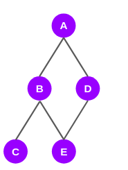
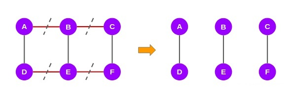

## 社区的定义

从图的角度来说，每一个节点都是一个个体单位，社区就可以定义为节点的子集，社区内的节点之间联系紧密，各个社区之间的连接较为松散，就好像由个体单位组成的社区，你在中关村，我在回龙观。

## 社区检测的目的

在网络分析中，检测网络中的社区是一个非常重要的任务。其基本逻辑就是在一个大型的网络中(比如网络连通关系、社交网络)中，可能存在上百万个节点和边，在这样规模的网络中探测社区是一项非常艰巨的任务。因此我们需要进行社区检测，将一个巨大的网络划分为多个社区，找到网络中多个联系紧密的节点簇。

## 社区检测方法分类

### 聚合方法

在聚合方法中，在开始阶段图中只有节点没有边。接下来根据边的权重或强弱一次将边添加到图中，最终完成图的整体构建。其中边的强度或者权重是可以通过不同算法计算获得的。这种算法简单且高效，但是两个点一旦合并就会永远在一个社区中，并且这种算法对单个的节点比较敏感，同时容易陷入局部最优当中。

#### Newman算法

[Newman算法](https://artowen.su.domains/courses/321/readings/PhysRevE_69_066133.pdf)的基本思想：不断地选择是模块度增长最大的两个社团进行合并

算法步骤：

> Step1. 每个点当作一个社团
>
> Step2. 计算两个社团合并后模块度的变化(增长) ΔQ，选取使得ΔQ最大的两个社团进行合并 
>
> Step3. 重复step2直到最后合并为一个社团

#### Newman算法的优化

Newman算法复杂性是$O((m+n)n)$,[Clause,Newman和Moore对该算法进行了优化](http://ece-research.unm.edu/ifis/papers/community-moore.pdf)，利用最大堆将该算法复杂度降低为$O(n(logn)^2)$，主要的优化方法方法就是对采用了局部模块化函数：
$$
Q=\sum_{i=1}^{N}\frac{l_i}{l_a}
$$
其中：

$i$表示$N$个社区中的一个

$l_i$表示社区内边的个数

$l_a$表示与社区内节点相连的边的个数

对于该算法也有很多的优化方法：

> 1.multistep贪婪算法：每次迭代合并多个社区，为并非每次只合并一个社区
>
> 2.归一化ΔQ，消除社团大小的影响

### 分裂方法

在分裂方法中，一般采用与聚合方法相反的途径，在开始阶段的图中包含完整的边。通过依次迭代删除图中已经存在的边，其中权重最大的边缘最先被移除。在这种方式下，每次移除一个边后，都需要对边的权重或强度进行重新计算，因为删除一条边之后，剩余边的权重也会相应发生变化。经过一定次数的迭代后，删除一定规模的边后就可以获得连接紧密的节点簇。

#### Girvan-Newman(GN)算法

##### 边介数中心性

Girvan-Newman算法根据图的边介数中心性(Edge Betweenness Centrality,EBC)数值作为社区分割的判定基础。其中介数中心性的函数如下：
$$
C_B(v)=\sum_{s\neq v \neq t \in V} \frac{ {\sigma}_{st}(v)} { {\sigma}_{st} }
$$
其中${\sigma}_{st}(v)$表示经过节点$v$的$s->t$的最短路径数，也就是说介数中心性反映了节点v作为“桥梁”的重要程度。如果重要程度比较高，则证明该节点可能是链接两个社区的桥梁。

我们采用[一篇博客](https://zhuanlan.zhihu.com/p/164772126)中的例子进行解析，首先有一个网络结构图下：

我们先计算从节点A开始的信息，那么从A到B和D的最短路径分别为1：

则从A到C和E的最短路径都经过BD，A到C的最短路径为1，从A都E的最带路径为2：

从A到F的最短路径会经过B D C E,最短路径的个数为3:，最终我们可以得到A到其他节点的最短路径个数如下图：

根据每个节点的最短路径个数，计算每个边的得分，其中得分的计算顺序和计算最短路径的方向相反：

到目前为止，我们已经计算出了相对于节点A的最短路径的边缘分数，我们将再对剩下的5个节点重复同样的步骤。最后，我们将得到网络中所有边的6个分数。我们将这些分数相加，并将其分配到原始图表中，如下图所示:

由于这是一个无向图，我们将这些分数除以2就得到了最终的EBC分数：

计算出EBC得分后，去掉得分最高好的边就将一个图进行分裂，在当前例子中，AB, BC, DE, EF这条边得分最高，把这些边去掉，就得到了三个子图或者三个社区：

GN算法的主要流程如下：

> （1）计算网络中所有边的边介数；
> （2）找到边介数最高的边并将它从网络中移除；
> （3）重复步骤2，直到每个节点成为一个独立的社区为止，即网络中没有边存在。

如果一直分割下去，就会将一个图分割成节点的集合，所有的边都被分割了。显然这种情况使不允许的，因此需要一个衡量标准，作为分裂结束的标准，这个标准就是模块度函数。

##### 模块度函数

模块度函数 $Q$来定量的衡量社区划分的结果。该度量标准自提出以来，逐渐被大多数研究者们接受，并发展了很多以模块度为目标函数的新算法。模块度函数如下式：
$$
Q=\sum_{i=1}^{N}(\frac{l_s}{L}-(\frac{d_s}{2L})^2)
$$
其中：

$i$表示$N$个社区中的第$i$个社区

$l_s$表示第i个社区内所有节点之间的边的个数

$d_s$表示连接了第$i$个社区内节点的所有的边的个数，这些边包括社区外的点与社区内点连接的边

L表示网络内所有的边

Girvan-Newman算法中每去除一次边，则计算一下所得社区结构的$Q$值，寻找到$Q$值最大时的社区分割情况。这个计算过程需要遍历完成的分割过程，从分割第一边开始，到切割到最后一个边后边结束。并在这个完整过程中选择$Q$的最大值对应的社区分布。

### 剖分方法

 把一个网络划分成多个社团就是把一个图剖分成多个图，图的剖分问题是图论中一个比较难的问题，也是研究比较多的问题，理论上是NP-hard的。因此，人们通常研究比较简单的情况：图的二剖分，即把一个图分成两个(一般要求大小相等)的图，比较有名的算法是Kernighan-Lin 算法和谱平分法。

需要注意的是，图的剖分常常需要制定子图的个数(否则，整体作为一个)，甚至每个子图的大小(否则，常常会将一个点分为一个子图)。但是如果已知一个图就是两个社团组成，谱评分法往往可以得到很好的效果。

#### Kernighan-Lin 算法

[Kernighan-Lin 算法](https://ieeexplore.ieee.org/document/6771089)将图随机划分为两个大小相同的子图，不断交换两个子图中的点，使得两个子图之间的边尽可能地少；
定义增益函数: Q=两个社团内的边数-社团之间的边数
算法步骤：

Step1 随机划分为已知大小的两个社团

Step2 从两个社团各取一个点，尝试交换并计算ΔQ = Q交换后-Q交换前，选择使ΔQ最大的一对节点对交换

Step3 规定每个节点只能交换一次，对剩余节点重复step2, 直到 ΔQ <0，或者某个子图的所有节点都被交换了一次为止。

Step4 允许每个节点的第二次交换,开始新一轮迭代,直到没有节点对可以交换。

Step5  最终将一个图分为两个子图（社区）。

#### 谱平分法

所谓“谱”，就是矩阵的特征值；所谓“平分”，就是将一个图分成大小相等的两个子图。谱平分法就是利用图的拉普拉斯矩阵的第二小特征向量来进行聚类的一种方法。

### 谱算法

 首先给出一个概念——图的Laplacian 矩阵（L-矩阵）。设A为图的邻接矩阵； D为一个对角阵(对角元素为点 i 的度)，则图的Laplacian矩阵L=D-A。关于L-矩阵，有很多性质，如：(1) 矩阵的每一行的元素之和为0 ，由此可以知道该矩阵至少一个0特征值，并且0特征值对应的特征向量为全1向量（1,1,...,1）。（2）0 特征向量的个数与连通分支的个数相同；如果一个图是连通的，那么其Laplacian矩阵只有一个0特征值，其余特征值都是正的。(3)不同特征值的特征向量正交的。
所谓谱，就是指矩阵的特征值。谱算法就是利用邻接矩阵或者拉普拉斯矩阵的特征向量，将点投影到一个新的空间，在新的空间用传统的聚类方法(如k-means)来聚类。

谱算法的一般步骤是:

> Step1. 计算相似矩阵(如邻接矩阵A)的前 s 个特征向量 
>
> Step2. 令 U 是一个 n× s 矩阵，每一列是一个特征向量 
>
> Step3. U 的第 i 行作为点 i 的坐标，用层次聚类法或者k-means等得到最终的社团

需要说明一点是: 如果是计算邻接矩阵的特征值，一般取最大的s个特征值；如果是计算Laplacian矩阵的特征值，则是计算最小的（除0外）s个特征值。

 前面我们提到过谱平分法，就是利用Laplacian矩阵倒数第二个小的特征值对应的特征向量(称为Fiedler 向量)来聚类的。因为需要把一个图平分成两个子图，因此就把Fiedler向量中正的分量对应的点分成一类，负的分量对应的点分成另一类。

谱算法的计算瓶颈是计算矩阵的特征值，因为少数的几个特征向量就可以得到很好的聚类，所以只需要计算最大的几个特征值既可以，可以考虑用Lanczos method。

### 矩阵分解

谱算法的实质是矩阵分解，其他的矩阵分解方法还有SVD 和 NMF 等，矩阵分解的整体思想就是把点从一个空间映射到另一个空间，在新的空间利用传统的聚类方法来聚类。

### 标签传播算法

[标签传播(Label propagation)算法](https://citeseer.ist.psu.edu/viewdoc/download;jsessionid=DBA5682AA334E7CD8A6A00156AD20FBE?doi=10.1.1.14.3864&rep=rep1&type=pdf)是由Zhu X J于2002年提出，它是一种基于图的半监督学习方法，其基本思路是用已标记节点的标签信息去预测未标记节点的标签信息。2007年，Raghavan U N等最早提出将LPA最早应用于社区发现，该算法被简称为[RAK算法](https://dollar.biz.uiowa.edu/~street/raghavan07.pdf)。标签传播算法尽管速度快，但是效果并不太理想。

思想: 每个节点赋予一个标签标志着其所在社区，每次迭代，每个节点标签根据其大多数邻近节点的标签而修改，收敛后具有相同标签的节点属于同一个社区。
算法步骤:
Step1 给每一个节点随机生成一个标签
Step2 随机生成一个所有节点的顺序，按照该顺序将每一个节点的标签修改为其大多数邻居节点的标签。
Step3 重复step2，直到每个节点的标签都不再变化，具有相同标签的节点组成了一个社区。

### 随机游走

随机游走: 从一个顶点向下一个顶点移动时，以相等的概率来选择当前顶点的一个邻居作为下一个顶点。
当网络存在某一个相对比较稠密的子图时，因此在图中进行随机游走时很容易“陷入”这个稠密的子图中。

随机游走的过程可以构成一个马尔科夫链的过程，每一次节点的移动，都是当前状态和状态转移矩阵的乘积。

节点之间的转移矩阵：
$$
P_{ij}=\frac{A_{ij}}{d_i}
$$
$A_{ij}$表示连个节点之间的连通性，也可以是邻接矩阵

$d_i$表示$i$节点边的个数，也可以是度矩阵

#### Walktrap算法

[Walktrap算法](https://arxiv.org/pdf/physics/0512106.pdf)中距离的主要计算公式如下：

节点$i$到节点$j$之间的距离计算公式：
$$
R_{ij}^t=\sqrt{\sum_{k=1}^{n}\frac{(P_{ik}^{t}-P_{jk}^{t})^2}{d_k}}
$$
社区$C$到节点$j$的距离计算计算公式：
$$
R_{Cj}^{t}=\frac{1}{|C|}\sum_{i\in1}R_{ij}^t
$$
社区A与社区B之间的距离计算公式：
$$
R_{AB}^t=\sqrt{\sum_{k=1}^{n}\frac{(R_{Ak}^t-R_{Bk^t})^2}{d_k}}
$$
算法的步骤：

Step1 每一个点当做一个社区，计算相邻的点(社团)之间的距离;

Step2 选取使得下式最小的两个社团A和B合并为一个社团C;
$$
\begin{align*}\Delta \sigma(A,B)&=\frac{1}{n}(\sum_{1 \in C}R_{iC}^t-\sum_{1 \in A}R_{iA}^t-\sum_{1 \in B}R_{iB}^t)\\
&=\frac{1}{n}\frac{|A||B|}{|A|+|B|}R_{AB}^t
\end{align*}
$$
Step3 重复这一步骤直到所有点合并为一个社团.

### Louvain (BGLL) 算法

 Louvain (BGLL) 算法[8]是一个基于模块度最优化的启发式算法，算法两层迭代，外层的迭代是自下而上的凝聚法，内层的迭代是凝聚法加上交换策略，避免了单纯凝聚方法的一个很大的缺点(两个节点一旦合并，就没法再分开)。

算法步骤：

> Step1 每一个点初始时被看作一个社团, 按一定次序依次遍历每一个顶点. 对每一个顶点i ，考虑将 i 移至其邻居顶点 j 的社团中模块度的变化ΔQ 。如果 ΔQ>0，将 顶点i 移至使得ΔQ变化最大的顶点的社团中; 否则，顶点 i 保持不动。重复这个过程，直到任何顶点的移动都不能使模块度增大。
>
> Step2 将step1得到的每一个社团看作一个新的顶点，开始新的一轮迭代，直到模块度不再变化。

该算法简单、直观，容易实现；速度快，并且效果也很好。综合效率和效果两方面考虑，该算法应该是目前最好的方法之一。

### Canopy算法 + K-Means

####  Canopy算法

思想：选择计算代价较低的方法计算相似性，将相似的对象放在一个子集中，这个子集被叫做Canopy,不同Canopy之间可以是重叠的
算法步骤:
Step1 设节点集为 S，预设两个距离阈值 T1和 T2（T1>T2）；
Step2 从S中任选一个节点P，用低成本方法快速计算节点P与所有Canopy之间的距离，将节点P加入到距离在小于T1的Canopy中；如果不存在这样的Canopy，则把点P作为一个新的Canopy的中心，并与结点P距离在 T2 以内的点新的Canopy中去掉；
Step3 重复step2, 直到 S 为空为止。

该算法精度低，但是速度快，常常作为“粗”聚类，得到一个k值，再用k-means进一步聚类，不属于同一Canopy 的对象之间不进行相似性计算。

#### K-Means

K-Means大家都比较熟悉，基本思想是首先找各个社团的“中心点”, 然后就近分配每个顶点
算法步骤：选取k个点作为 k个社团的初始中心点
Step1. 把每个点分配到最近的中心点所在的社团;
Step2. 重新计算中心点，如果中心点不变, stop; 否则, 转 step1.
K-Means算法计算量相对比较大，效果往往还不错，但是使用前要考虑一点：通过各个分量求平均得到的中心点是否有意义， 也就是说在你的问题中欧式距离是否有意义。

#### 密度聚类

2014年science上有一篇关于[聚类的文章](https://sites.psu.edu/mcnl/files/2017/03/9-2dhti48.pdf)，提出一种快速的聚类方法，基本思想是: 找出每个类的中心点，将剩余的点按一定策略分配到每个类中。思想很简单，但是文中找每个类中心点的做法还是很有新意的。

Step1 对每一个点i，计算两个量：点i的密度$\rho_{i}=\sum \chi(d_{ij}-d_c)$或者$\rho_{i}=\sum \exp(\frac{d_{ij}}{d_c})^2$以及点i到密度比其更高的所有点的最小距离$\delta_i={\min}_{j:\rho_j>\rho_i}{d_{ij}}$

Step2 选取$\rho$和$\delta$都较大的点作为一个社区的中心点（背后的思想是：类的中心应该密度比较大，不同类的中心相互之间应该离的比较远）

Step3 对于剩余的非中心点，分配给离它最近且密度比它高的邻点所坐在的社区

