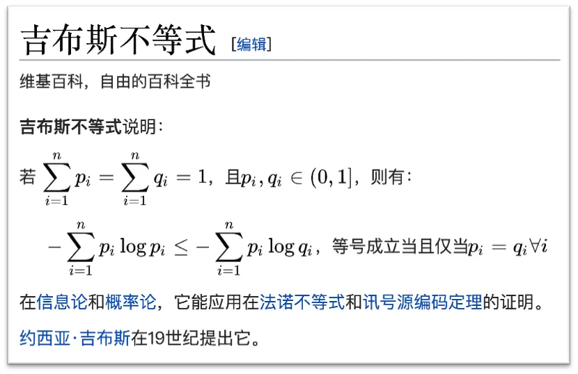
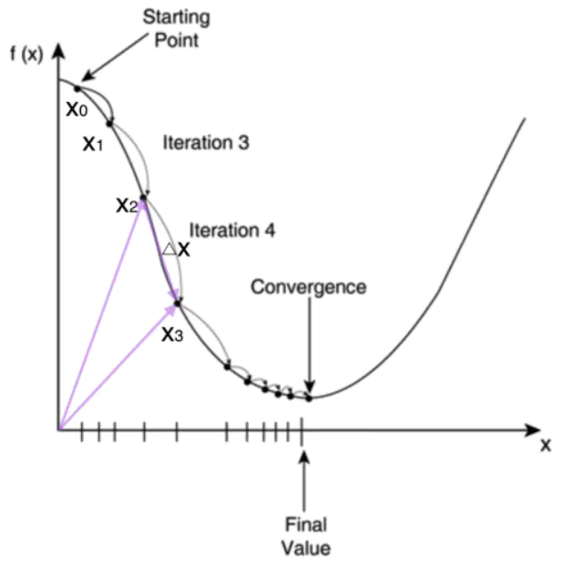
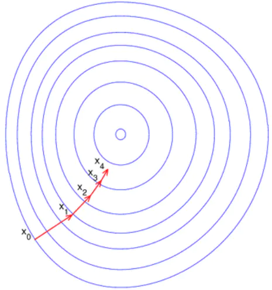

# 模型优化过程

有一种说法：机器学习本质上就是学习数据背后的规律，或者说用机器学习拟合数据的分布情况。而机器学习的作用就是在模型哪怕并不清楚任务的定义和规律，他依然可以算法模型的学习将这个规律给找出来。那么机器学习是怎么发现数据背后的规律的呢？首先就是猜一个预测结果，然后将预测结果和真实结果进行比较，根据预测结果和真实结果之间的差别进行调整，调整之后再比较，比较之后在调整。。。

猜测比较好理解，给出一个结果无论好坏；那么怎么将预测结果和真实结果进行比较呢？就是通过损失函数！如何调整预测结果呢？可就是优化算法！如何掌控调整的速度呢？设定学习率！这里我们先介绍损失函数。

举一个例子，对于一个未曾经过训练的神经网络，那么神经网络内部的参数$w$和$b$还都是“猜出来”的初始值。在不考虑结果好坏的情况下，没有经过训练的神经网络也可以完成一次预测。这个预测结果$\hat y$要和真实结果$y$之间肯定是存在差异的，我们需要有一个函数来量化二者之间的差异，这个函数就是损失函数。直白点说，损失函数就是来描述机器学习模型的靠谱程度的。

## 损失函数

### 最小二乘法(均方差损失函数MSE)

那么如何用损失函数来描述预测结果和真实结果之间差异呢？一个最简单的方法就是将预测结果$\hat y$和真实结果$y$做差，然后把这些差值都加起来,当这个结果取最小值时，表明预测结果和真实结果之间的差异最小，公式表示如下：
$$
Loss=\sum_{i=1}^n |\hat y_i-y_i|
$$
如何让这个损失函数最小呢，那就是对其求导，如果这个函数是下凸函数，那么一阶导数为0的时候，我们就找到了损失函数最小值。但是我们知道这个函数并不是在全定义内可导（当差值为0时不可导），因此我们对这个损失函数做了优化，就是把绝对值换成平方，同时增加一个$\frac{1}{2}$的系数，使损失函数求导后看着更简洁：
$$
Loss=\sum_{i=1}^n \frac{1}{2}(\hat y_i-y_i)^2
$$
而描述上面这个公式求取最小值的过程就是最小二乘法，二乘就是以前对平方的一种称呼。

### 最大似然估计

我们以抛硬币为例子，假如说我抛了10次硬币，结果7次正面3次反面。那是不是说抛硬币的时候正面的概率就是70%，反面就是30%呢？虽然这和我们的直观感受很类似，但事实上并不一定是这样的。因为你下次再抛10次硬币，可能6次正面4次反面。如果运气爆表可能10次都是正面！

也就是说我们根据抛硬币的结果很难唯一确定真实的概率分布（真实的概率分布就是抛硬币背后的规律）。虽然如此，我们仍可以根据抛硬币的结果确定最有可能的概率分布什么样的。

比如$C1$~$C10$代表十次抛硬币的结果，$\theta$表示硬币正面的属性(这个属性未知，可以将其理解为硬币固有的概率属性),那么抛10硬币硬币7次正面的概率公式如下：
$$
\begin{align}
P(C_1,C_2,C_3,...,C_{10}|\theta)
&=\begin{pmatrix} 10 \\ 7 \\ \end{pmatrix}\prod_{i=1}^{10}P(C_i|\theta)\\
&=C_{10}^7p^7(1-p)^3
\end{align}
$$
我们硬币正面的概率属性分别为0.1, 0.7, 0.8，我们就可以计算抛10次硬币7次正面的概率：

计算可以得出，当正面概率为0.7时，抛10次硬币7次正面的概率是最大的。所以我们说抛10次硬币7次正面，不能说明硬币正面的概率就是0.7，但是概率是0.7的可能性最大！这就是最大似然估计的思路。“最大”就是指可能性最大，“似然”就是指和真实概率分布的相似程度。

我们知道最大似然估计的函数形式是这样的：
$$
\mathcal{L}(\hat y,y)=-y\log \hat y-(1-y)\log(1-\hat y) 
$$
但是为什么这个函数形式就是最大似然估计的函数呢，我们以抛硬币为例子来进行推导：
$$
\begin{align}
&P(x_1,x_2,x_3,...,x_n,y_1,y_2,y_3,...,y_n|W,b),其中各个样本(x_i,y_i)之间是独立的\\
&=\prod_{i=1}^{n}P(x_i,y_i|W,b),其中P(A,B)=P(A|B)P(B)\\
&=\prod_{i=1}^{n}P(y_i|x_i,W,b)*P(x_i),其中x_i表示抛一次硬币，所以都是等概率的，因此P(x_i)是一个常量\\
&=\prod_{i=1}^{n}P(y_i|\hat y_i)*P(x_i),展开二项式分布\\
&=\begin{pmatrix} n \\ k \\ \end{pmatrix}\prod_{i=1}^{n}\hat{y_i}^{y_i}*(1-\hat{y_i})^{1-y_i}*P(x_i),其中\begin{pmatrix} n \\ k \\ \end{pmatrix}也是一个常数
\end{align}
$$
因此我们只需要对上式中的非常数部分去最大值，就可以获取最接近真实分布（背后的规律）的参数$(W,b)$了。
$$
\begin{align}
&\max P(x_1,x_2,x_3,...,x_n,y_1,y_2,y_3,...,y_n|W,b)\\
&=\max_{W,b} \xcancel{\begin{pmatrix} n \\ k \\ \end{pmatrix}}\prod_{i=1}^{n}\hat{y_i}^{y_i}*(1-\hat{y_i})^{1-y_i}\xcancel{*P(x_i)}\\
&=\max_{W,b} \log (\prod_{i=1}^{n}\hat{y_i}^{y_i}*(1-\hat{y_i})^{1-y_i})\\
&=\max_{W,b}\sum_{i=1}^n\log(\hat{y_i}^{y_i}*(1-\hat{y_i})^{1-y_i})\\
&=\max_{W,b}\sum_{i=1}^n(y_i*\log\hat y_i+(1-y_i)*\log(1-\hat y_i))\\
&=\min_{W,b}-\sum_{i=1}^n(y_i*\log\hat y_i+(1-y_i)*\log(1-\hat y_i))
\end{align}
$$
这就和开头展示的最大似然函数对应上了。通过最大似然函数，我们就可以根据当前数据集合的概率分布情况，找到可能性最大的真实概率分布。其实，最大似然估计法很多人也把它称为交叉熵法，这是因为极大似然估计法和交叉熵方法是彻彻底底的等价。

### 最小交叉熵

最大似然估计写出来的损失函数，也被叫做交叉熵损失函数。那么为什么同样的一个损失函数的写法会有不同名字呢，或者说为什么两个互不相干的内容可以用同一个东西表示呢？那么我们就要了解关于熵的概念。

#### 信息量

香农(Shannon)认为“信息是用来消除随机不确定性的东西”，也就是说衡量一个事件信息量大小就看这个信息消除事件不确定性的程度。也即是说信息量的大小和事件发生的概率成反比，可以表示如下，
$$
I(x)=\log p(x)
$$
其中$x$表示事件，$p(x)$表示事件发生的概率。

#### 信息熵

熵的物理意义是对体系混乱程度的一种度量方式。后来，香农将熵的概念引入到信息论中，提出了所谓的“信息熵”概念，从概率论的角度来看，就是说某个事件发生的不确定性越大，信息熵就越大。下文中提到的熵都是指“信息熵”。信息熵的公式如下：
$$
H(X)=-\sum_{i=0}^np(x_i)\log(p(x_i))
$$
公式中的 $p(x_i)$ 表示事件发生第$i$种情况的概率。对于0-1分布（伯努利分布），如掷硬币只有正反两面，或者一个事件只有成功和失败两种可能等，熵的公式可以去掉求和公式：
$$
H(X)=-p(x)\log p(x)-(1-p)\log(1-p(x))
$$
是不是和交叉熵挺像的，是不是他只描述一个分布。

#### KL散度

大家平时说的KL散度（其实也是一种熵，我们称之为相对熵。KL散度可以用来度量两个分布的相似度，比如在机器学习中，我们就可以用KL散度来衡量样本真实分布与预测分布之间的差异。那么KL散度怎么样的结果才能表达真实分布和预测分布之间的差异性大小呢，这就引出了一个重要的公式，吉布斯不等式：

也就是说我们如果找到了KL散度的最小值，也就找到了最接近真实分布的预测分布。我们对KL散度进行持续推导：
$$
\begin{align}
D_{KL}(p,q) &=\sum_{i=0}^np(x_i)\log(\frac{p(x_i) }{q(x_i) } )\\
&=\sum_{i=0}^np(x_i)\log(p(x_i) )-\sum_{i=0}^n p(x_i)\log(q(x_i) )\\
&=-H-\sum_{i=0}^np(x_i)\log(q(x_i) )\\
&=-H-Cross\_entropy
\end{align}
$$
因为上式$H$为$p$分布的信息熵，他是一个常数。所以就可以通过交叉熵来衡量两个分布之间的相似度，并且通过优化交叉熵的最小值来寻找最佳的预测分布。

需要注意的是$D_{KL}(p,q)\neq D_{KL}(q,p)$,因为$D_{KL}(p,q)$表示以$p$分布作为基准的，

#### 交叉熵损失

根据对KL散度的推导，我们得到交叉熵公式：
$$
\begin{align}
H(p,q)
&=-\sum_{i=1}^np(x_i)*\log q(x_i)\\
&=-\frac{1}{C}\sum_{k=1}^C \sum_{i=1}^n y_{ki}\log p_{ki}
\end{align}
$$
其中：

$C$为样本数量

$n$为类别数量

$y(k_i)$为表示样本$k$是否类别$i$，如实属于的话取1，不属于取0

$p(k_i)$表示样本$k$被预测为类别$i$的预测概率

我们将类别个数$n$设置为2，则公式就可以进行简写：
$$
H(p,q)=-p(x)\log q(x)-(1-p)\log(1-q(x))
$$
其中$p(x)$为基准分布，$q(x)$为预测分布。

至此交叉熵损失函数就推导完毕了。

## 优化方法

### 梯度下降

梯度指的是目标函数的导数方向，当变量维度大于1的时候，梯度就是这个点的法向量，并指向目标函数数值更高的方向，因此当目标函数为凸函数时，梯度下降法就可以求解全局最优解了。梯度下降法是最早并且最简单的最优化方法。梯度下降法的优化思想是用当前位置负梯度方向作为搜索方向，因为该方向为当前位置的最快下降方向，所以也被称为是”最速下降法“。最速下降法越接近目标值，步长越小，前进越慢。一般使用学习率来描述步长。

从目标函数层面描述梯度下降法，每一次下降的方向都是当前点的切线方向：

从目标函数结果的等高线层面描述梯度下降法，每一次下降的方向都是当前点的法向量方向：

梯度下降法的缺点，具体如下图所示：

1.靠近极小值时收敛速度减慢

2.直线搜索时可能会产生一些问题

3.可能会“之字形”地下降

从上图可以看出，梯度下降法在接近最优解的区域收敛速度明显变慢，利用梯度下降法求解需要很多次的迭代。在机器学习中，常用的有两种梯度下降方法.

#### 批量梯度下降法(BGD)

批量梯度下降每次更新都遍历训练集中所有的样本，以它们的预测误差之和为依据更新。当训练样本数很大时，批量梯度下降的每次更新都会是计算量很大的操作。

假设用批量梯度下降法作为优化方法优化一个线性回归的模型，$h(x)$为需要拟合函数，$J(\theta)$为损失函数，$m$为样本个数，$n$为特征维度：
$$
h(\theta)=\sum_{j=1}^n\theta_j*x_j\\
j(\theta)=\frac{1}{2m}\sum_{i=1}^m(y_i-h_{\theta}(x_i))^2\\
梯度=\frac{\partial J(\theta)}{\partial \theta_j}
$$
如果采用批量梯度下降法，可以获得全局最优解，但是每迭代一步，计算量是$m*n^2$，$m$为样本个数，$n$为特征维数，都要用到训练集的所有数据，如果$m$很大，那么迭代速度会很慢。所以实际情况下，我们一般不用固定的学习率，而是让它随着算法的运行逐渐减小到零，也就是在接近“山底”的时候慢慢减小下降的“步幅”，换成用“小碎步”走，这样它就更容易收敛于全局最小值而不是围绕它振荡了。

#### 随机梯度下降(SGD)

随机梯度下降是通过每个样本来迭代更新一次，如果样本量很大的情况（例如几十万），那么可能只用其中几万条或者几千条的样本，就已经将theta迭代到最优解了，对比上面的批量梯度下降，迭代一次需要用到十几万训练样本，一次迭代不可能最优，如果迭代10次的话就需要遍历训练样本10次。但是，SGD伴随的一个问题是噪音较BGD要多，使得SGD并不是每次迭代都向着整体最优化方向。

SGD的问题是噪音比BGD要多，使得SGD不是每次迭代都向着整体最优的方向，SGD以损失一部分精确度和增加一定的迭代次数为代价，换取了总体的优化效率的提升，增加的迭代次数远小于样本的数量。

#### SGD和BGD的区别

SGD：最小化每个样本的损失函数，虽然不能确定每次迭代得到的损失函数都是向着全局最优的方向进行优化，但是可以确定大方向是全局最优解，最终的结果也会出现在全局最优价的附近，这种方法适合大规模的样本训练的情况。

BGD：最小化所有样本的损失函数，使得最终求解为全局最优解，但是对于大样本的情况下效率比较低；

### 牛顿法

牛顿法属于利用一阶和二阶导数的无约束目标最优化方法。基本思想是，在每一次迭代中，以牛顿方向为搜索方向进行更新。牛顿法对目标的可导性更严格，要求二阶可导。牛顿法使用函数$f(x)$的二阶泰勒级数来寻找方程$f(x)=0$的根。牛顿法最大的特点就在于它的收敛速度很快。其基本流程是：

1.明确当前预测值对应的损失函数，获取损失函数的梯度，根据梯度（损失函数的导数）计算梯度斜率曲线与$x_i$轴的交点，也就是计算以下方程的解：
$$
x*f'(x_i)+f(x_i)-x_i*f'(x_i)=0
$$
2.获取下一个节点$x_{i+1}$的值,后续优化的节点：
$$
x_{i+i}=x_i-\frac{f(x_i)}{f'(x_i)}
$$
3.根据$f'(x_{i+1})$的取值，继续优化，当其取值为0或者无限接近于0时，优化结束。

已经证明，如果$f'(x)$是连续的，并且目标点$x$是孤立明确的，那么零点$x$周围存在一个区域，只要初始点$x_0$在这个临近区域内，牛顿法就一定是收敛的。并且如果$f'(x)$不为0，那么牛顿法将具有平方收敛的性能。

#### 阻尼牛顿法

从上面的推导中看出，牛顿方向能使得更新后函数处于极值点，但是它不一定是极小点，也就是说牛顿方向可能是下降方向，也可能是上升方向，以至于当初始点远离极小点时，牛顿法有可能不收敛。因此提出 阻尼牛顿法，在牛顿法的基础上，每次迭代除了计算更新方向（牛顿方向），还要对最优步长做一维搜索。 
其算法流程如下：

（1） 给定初始值$x_0$，允许误差

（2）计算x_0处的梯度和Hession矩阵，若梯度为0则停止迭代

（3）计算点x_0出的牛顿方向作为搜索方向：
$$
d^{(t)}=-H_t^{-1}g_t
$$
（4）从$x^{(t)}$出发，沿着牛顿方向$d^{(t)}$做一维搜索，获得最优步长：
$$
\lambda_t=\arg \min_{\lambda}f(x^{(t)}+\lambda*d^{(t)})
$$
（5）更新参数
$$
x^{(t+1)}=x^{(x)}+\lambda_t*d^{(t)}
$$
相比较牛顿法，阻尼牛顿法的一维搜索会在一定范围内寻找最优解。

#### 牛顿法的特点

牛顿法的优点：收敛速度快

牛顿法的缺点：它是一种迭代算法，每次都要计算目标函数的Hessian矩阵的逆矩阵，计算比较复杂。

#### 牛顿法与梯度下降法的区别

从本质来说，梯度下降法是一阶收敛，牛顿法是二阶收敛，所以牛顿法的收敛速度更快。梯度下降法每次考虑的是当前位置的负梯度下降，而牛顿法不但考虑当前位置下降的是否够快，还会考虑下一步下降的是否够大，也就是说牛顿法目标更长远一点。牛顿法是用一个二次曲面去拟合你当前所处位置的局部曲面，而梯度下降法使用一个平面去拟合当前的局部曲面，通常情况二次曲面拟合会比平面更好，所以牛顿法的下降路径会更符合真实的最优下降路径。

### 拟牛顿法(DFP、BFGS)

拟牛顿法的本质思想是改善牛顿法每次需要求解复杂的Hessian矩阵的逆矩阵的缺陷，它使用**正定矩阵来近似Hessian矩阵的逆**，从而简化了运算的复杂度。拟牛顿法和最速下降法一样只要求每一步迭代时知道目标函数的梯度。通过测量梯度的变化，构造一个目标函数的模型使之足以产生超线性收敛性。这类方法大大优于最速下降法，尤其对于困难的问题。另外，因为拟牛顿法不需要二阶导数的信息，所以有时比牛顿法更为有效。如今，优化软件中包含了大量的拟牛顿算法用来解决无约束，约束，和大规模的优化问题。

### 共轭梯度法

共轭梯度法是介于最速下降法与牛顿法之间的一个方法，它仅需利用一阶导数信息，但克服了最速下降法收敛慢的缺点，又避免了牛顿法需要存储和计算Hesse矩阵并求逆的缺点，共轭梯度法不仅是解决大型线性方程组最有用的方法之一，也是解大型非线性最优化最有效的算法之一。在各种优化算法中，共轭梯度法是非常重要的一种。其优点是所需存储量小，具有步收敛性，稳定性高，而且不需要任何外来参数。

### 启发式优化方法

启发式方法是指人在解决优化问题时所采取的一种根据经验规则进行发现的方法。其特点是在解决问题时，利用过去的经验，选择已经行之有效的方法，而不是系统地、以确定的步骤去寻求答案。启发式优化方法种类繁多，包括经典的**模拟退火方法，遗传算法、蚁群算法以及粒子群算法**等等。
 还有一种特殊的优化算法被称之**多目标优化算法**，它主要针对同时优化多个目标（两个及两个以上）的优化问题，这方面比较经典的算法有**NSGAII算法、MOEA/D算法以及人工免疫算法**等。

### EM算法

EM算法是一类算法的总称。EM算法分为E-step和M-step两步。EM算法的应用范围很广，基本机器学习需要迭代优化参数的模型在优化时都可以使用EM算法。

#### EM算法的思想和过程

 E-step：E的全称是Exception，即期望的意思。E-step也是获取期望的过程。根据现有的模型，计算各个观测数据输入到模型中的结果。这个过程称为期望值计算过程，即E过程。
 M-step：M的全称是Maximization，即最大化的意思。M-step也是期望最大化的过程。得到一轮期望值以后，重新计算模型参数，以最大化期望值。这个过程为最大化过程，即M过程。
 最大化的意思是我们在使用这个模型时希望我们定义的函数能使得到的结果最大化，而结果越大越接近我们希望得到的结果。我们优化的目标也就是这些能得到最大值的函数。
 常见的EM算法有：**隐含马尔科夫模型的训练方法Baum-Welch算法；最大熵模型的训练方法GIS算法等**。

#### EM算法结果

 EM算法不一定能保证获得全局最优解，但如果我们优化的目标函数是一个凸函数，那么一定能保证得到全局最优解。否则可能获得局部最优解。因为如果优化的目标函数有多个峰值点，则如果优化到某个不是最高的峰值点处，则会无法再继续下去，这样获得的是局部最优解。

#### EM算法总结

 EM算法只需要输入一些训练数据，同时定义一个最大化函数，接下来经过若干次迭代，就可以蓄念出我们需要的模型了。

附录：

附录：

https://www.bilibili.com/read/cv15258489?spm_id_from=333.999.0.0

https://www.bilibili.com/read/cv14977249?spm_id_from=333.999.0.0

https://www.jianshu.com/p/76416e2d89f7#:~:text=%E6%9C%BA%E5%99%A8%E5%AD%A6%E4%B9%A0%E5%B8%B8%E8%A7%81%E7%9A%84%E4%BC%98%E5%8C%96%E7%AE%97%E6%B3%95%201%20%E6%A2%AF%E5%BA%A6%E4%B8%8B%E9%99%8D%E6%B3%95%202%20%E7%89%9B%E9%A1%BF%E6%B3%95%203%20%E6%8B%9F%E7%89%9B%E9%A1%BF%E6%B3%95%EF%BC%88DFP%E3%80%81BFGS%EF%BC%89%204,%E5%85%B1%E8%BD%AD%E6%A2%AF%E5%BA%A6%E6%B3%95%EF%BC%88Conjugate%20Gradient%EF%BC%89%205%20%E5%90%AF%E5%8F%91%E5%BC%8F%E4%BC%98%E5%8C%96%E6%96%B9%E6%B3%95%206%20EM%E7%AE%97%E6%B3%95%207%20%E5%B0%8F%E7%BB%93

