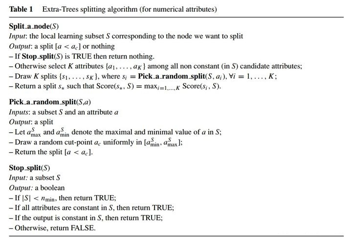
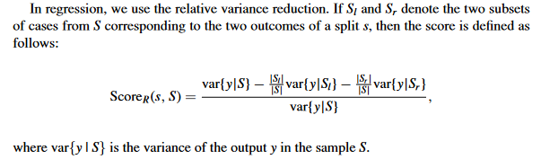
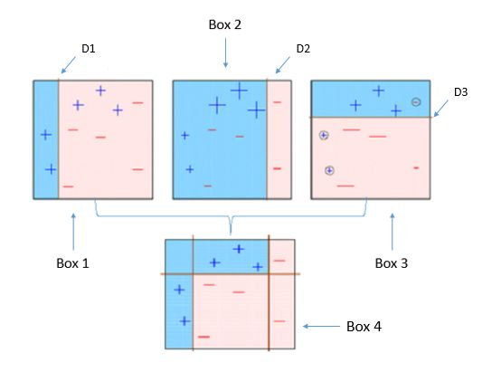
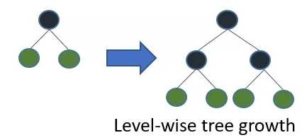
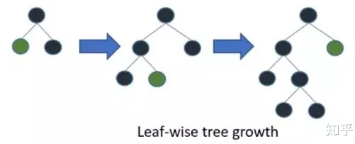
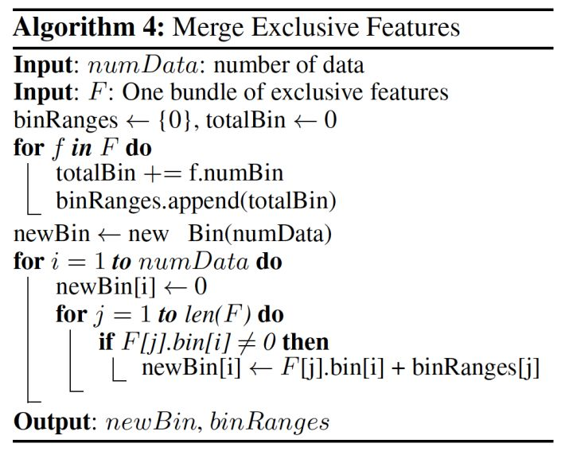

## 1 Bagging

Bagging这个名字是Bootstrap Aggregating的缩写，意思是引导聚合的意思。该方法通过自助采样（bootstrap sampling）将训练集集分为多个子训练集，并用每一个子训练集训练一个个体学习器（基学习器）。利用Bagging框架实现的机器学习方法，常见的有随机森林（Random Rorest）和极端随机树（Extremely randomized trees）。

### 1.1 随机森林

随机森林（Random Forest）是Gagging框架下的一个经典算法，RF在样本进行抽样的同时，也对特征空间集合d进行抽样，作为个体学习器的决策树CART都有自己的特征空间子集合k。

特征空间的子集合如果和特征空间集合相同，即d=k，则所有的个体学习器的特征空间都相同；如果特征空间子集合k=1，则所有个体学习期都只有一个特征来构建决策树。一般推荐这个值为k=log<sub>2</sub> d。

对于每一个个体学习器的训练，都是在子训练集下对特征空间子集合训练cart树，训练过程与决策树的训练基本相同，其中，不同的地方在于随机森林中个体学习器CART会最大可能的生产，并且不进行剪枝操作，这是因为多个自学习器的组合分析可以很好的解决过拟合问题，有效的降低方差。

### 1.2 极度随机树

极度随机树（Extremely randomized trees）可以认为是随机森林的一个变种，其基本原理和随机森林一样，不过个体学习器的训练过程存在不同。

ET的每个个体学习器决策树都对所有训练样本进行训练，并不进行bootstrap抽样。但是在选取最佳分割特征时，是完全随机选择的，这个随机不仅仅是特征维度，而且是特征值，二者都是随机的。这种随机方法导致单个决策树的预测是不准确的，但是多个个体学习器组合在一起就会有很好的预测结果。ET的算法流程如下图：



这里的精髓在于如何选择分裂节点。Extra Trees会直接采用全体样本，随机选择K个特征，对于这K个特征，每个特征随机选择1个分裂节点，从而得到K个分类节点。然后计算这K个分裂节点的分数，选择得分最高的节点作为分裂节点。

对于分裂点的选择，引入一个score的概念。

对于分类：


H<sub>c</sub>(S):数据集的信息熵

H<sub>S</sub>(S):数据集的分割熵

I<sub>C</sub><sup>s</sup>(S):分裂结果与分类标签之间的互信息

对于回归：



var{y|s}:表示样本集S的y值的方差。


对于整个算法层面来说，ET最为重要的参数有三个：

K：决定了分割点新选择的偶然性，K越大偶然性越小，且一般情况下，K小于特征空间的大小。

n<sub>min</sub>：节点分割的最小样本数，如果小于样本数则停止分割，n<sub>min</sub>越大，单个树的深度越大.

M：ET中树的个数，M越大，模型的方差越小

## 2 Boosting


根据上图Bagging和Boost的对比中可以发现，相比于Bagging的并行训练，Boosting是串行的按照顺序训练弱学习器，根据学习器的表现对训练样本分布进行调整，基于调整后的样本再训练下一个学习器。最终综合多个弱分类器的结果给出最终的检测结果。本章节内容主要参考[相关博客](https://zhuanlan.zhihu.com/p/60909244)，并加入部分个人理解。

### 2.1 Adaboost

Adaboost（Adaptive Boosting）意思是自适应提升，也就是说算法在训练过程中允许个体学习器的训练误差，并且对基于当前学习器的误差情况，对分类错误的样本进行加权处理，通过对下一个分类器的加权，实现对分类错误样本的重点关注。并且Adaboost对个体学习器的应用比较灵活，可以采用很多机器学习算法作为弱分类器。

算法的流程如下：


其中：

N为样本个数

*w<sub>i</sub>*为每个样本的权重

M为个体学习器个数

G<sub>m</sub>(x)为个体学习器模型

a<sub>m</sub>为个体学习器权重

G(x)为集成后的检测模型

举例来说，如下图所示，Box 1 弱分类器, 正负样本被分为蓝（+）红（-）两个区域，红色区域有3个误分类正样本，Box 2 更关注它们（增加权重）。（Box 2 弱分类器）正负样本被分为蓝（+）红（-）两个区域，蓝色区域有3个误分类负样本，Box 3 更关注它们，通过不断调整样本权重最终将若干个弱分类器进行集成得到强的分类器 Box 4。




### 2.2 Boosting Tree

提升树模型是基学习器为决策树的加法模型，可以视为 AdaBoost 的特例。对于二分类问题只要取 AdaBoost 的基学习器为二分类树即可。不同问题提升树算法区别于其所用的损失函数，例如使用平方误差损失函数的回归问题、用指数损失函数的分类问题，以及用一般损失函数的一般决策问题。

对于Boost Tree我们主要讨论回归问题，对于分类问题，将在Gradient Boosting进行描述。

讨论平方损失函数的回归问题，要学的基学习器的树是关于输入空间X的划分，即将X划分为J个互不相交的区域R1,...,Rj，每一个区域R都代表一个叶子结点，且每个区域都确定一个常数r，这个r就是每个叶子结点对应的回归结果，这样一个决策树（一般为CART）表示为：
$$
T(x;\Theta)=\sum_{j=1}^{J}{r_jI(x\in R_j)}
$$
同时采用前向分布算法，在m步时：
$$
\hat{\Theta}_m=arg\;min\sum_{i=1}^{N}{L(y_i,f_{m-1}(x_i)+T(x_i;\Theta_m))}
$$
损失函数L，采用平方差损失函数：
$$
L(y,f(x)) = \frac{1}{2}(y-f(x))^2
$$
那么第m颗回归树的损失函数为：
$$
L(y_i,f_{m-1}(x_i)+T(x_i;\Theta_m))={\frac{1}{2}(y_i-f_{m-1}(x_i)-T(x_i;\Theta_m))^2}\\[2ex]
  \qquad\qquad\quad\qquad          ={\frac{1}{2}(r_i-T(x_i;\Theta_m))^2}
$$

其中，r<sub>i</sub>表示残差，第m步的回归树就是根据之前的残差拟合得到的Loss目标，并根据数据集N，得到最后的优化结果。但是这种优化方法对异常值非常敏感，因此就提出了梯度提升方法。

### 2.3 Gradient Boost

#### 2.3.1 Gradient Boosting的名称

梯度提升方法有很多的名称：

- Gradient Boosting Machine (GBM), by Friedman 	
- Multiple Additive Regression Trees (MART), by Friedman 
- TreeNet, Implementations for Gradient boosting/MART by Salford Systems, Inc.
- Gradient Boosting Decision Tree (GBDT) 
- Gradient Boosted Regression Tree (GBRT)

梯度提升总的来说是非常强大的机器学习算法，可以用来做 regression, classification, ranking.   从名字上看梯度提升方法是 Gradient Descent 和 Boosting 的结合.  为了应对更一般的损失函数，它与树提升方法的差异是：使用**损失函数的的负梯度**作为上述回归问题中**残差**的近似。这里的 GBDT 特指 "Greedy Function Approximation：A Gradient Boosting Machine" 中所提出的算法。

从优化的角度来说，梯度提升和梯度下降都是对Loss的优化方法，代表着相同的优化方向，以换取极值的结果。对残差的拟合来说是梯度提升，在对Loss的优化目标来说是梯度下降。

#### 2.3.2 常见损失函数

对梯度来说，常见的损失函数如下：


#### 2.3.3 梯度提升与梯度下降

对于表中的平方损失函数来说，我们的目标就是最小化损失函数：
$$
\mathop{\text{min} }_{f_i}J=\mathop{\text{min} }_{f_i}\;{\sum}_{i=1}^{N}{\frac{1}{2}(y_i-f_i)^2}
$$
其中y<sub>i</sub>是观测值，f<sub>i</sub>是优化的变量（函数），关于  f<sub>i </sub> 对  J  求偏导：
$$
\frac{\partial{J} }{\partial{f_i} }=f(x_i)-y_i
$$
因此，可以将残差（广义残差或伪残差 pseudo residuals）解释为损失函数的负梯度：
$$
r_i=y_i-f_{m-1}(x_i)=-\frac{\partial{J} }{\partial{f_i} }
$$
这也就解释了Gradient Boost和GBM在残差讯息上等价于最小化MSE损失函数，或者L2损失。因此地m个回归树的拟合结果为：
$$
\begin{align} f_m & =f_{m-1}+\nu T(\Theta_m)\\& =f_{m-1}+\nu\sum^{J}_{j=1}\gamma_{jm}I(x\in+R_{jm}) \end{align}\\
$$
其中 T 表示第 m 步根据损失函数负梯度拟合出的第 m 个回归树模型，v (by Friedman, line search, XGBoost 也适用) 表示 Shrinkage 操作，通过对新增树模型的缩放以减少它影响，同时为后续树预留学习空间。

#### 2.3.4 梯度提升的算法流程

梯度提升树（GBDT）的算法流程进行描述，如下图：


#### 2.3.5 梯度提升的回归问题

可以参见章节2.2 平方损失函数的举例。

#### 2.3.6 梯度提升的分类问题

相比于回归分类的平方损失函数，在分类中Gradient Boost的损失函数为交叉熵损失函数：
$$
\begin{align} L &=\arg\min\sum_{i=1}^{N}-y_i\log(pi)+(1-y_i)\log(1-p_i)\\
                &=\arg\min\sum_{i=1}^{N}-y_i\log(\frac{p_i}{1-p_i})-\log(1-p_i))
                ,令odds_i=\log(\frac{p_i}{1-p_i}),则\\
                &=\arg\min\sum_{i=1}^{N}-y_i\log(odds_i)-\log(1-\frac{e^{\log(odds_i)} }{1+e^{\log(odds_i)} })\\
                 &=\arg\min\sum_{i=1}^{N}-y\log(odds_i+\log(1+e^{\log(doos_i)})
                  \end{align}\\
$$
基于log（odds）对L损失函数求和中的部分求偏导：
$$
\begin{align}\frac{\partial{l} }{\partial{\log(odds_i)} } &=-y_1+\frac{e^{\log(odds)} }{1+e^{\log(odds)} },根据上式可知p_i=\frac{e^{\log(odds)} }{1+e^{\log(odds)} }\\
   &=-y_i+p_i            

 \end{align}\\
$$
由此可见基于平方损失函数的回归问题和基于交叉熵损失函数的分类问题的自恰。

关于分类的实际例子参看一下两篇博客：

[决策树之 GBDT 算法 - 分类部分](https://www.jianshu.com/p/f5e5db6b29f2)

[Gradient Boost Part 4: Classification Details](https://www.youtube.com/watch?v=StWY5QWMXCw&list=PLblh5JKOoLUICTaGLRoHQDuF_7q2GfuJF&index=48&t=187s)

#### 2.3.7 梯度提升的正则化

由于GBDT可以通过拟合残差快速降低LOSS，这也会造成一个问题，就是模型会存在low-bias, high-variance的情况，这是由于Gradient Boost对每一个个体学习器（基学习器）都有很强的相关性，因此模型存在过拟合的风险，因此可以通过以下的方法对过拟合进行缓解优化。

1.限制树的复杂度：树的深度，内部节点个数，叶子节点个数 (T)，叶节点分数 (w)

2.子采样（Subsampling）：即训练每个树的时候，只使用一部分的样本，例如 stochastic gradient boosting，第3行改为采样n倍的训练观测值（无放回），并且采用这种子采样来生成下一棵树；

3.列采样：即训练每个树的时候。只使用一部分的特征，这是 Xgboost 的创新，将随机森林中的思想引入了 GBDT；

4.Shrinkage：进一步惩罚，给每一个回归树乘一个小于 1 的系数, 也可以理解为设置了一个较低的学习率v ；

5.Early stop：而根据测试集的测试情况选择使用前若干棵树。

#### 2.3.8 梯度提升的核心函数

内容参考[博客](https://zhuanlan.zhihu.com/p/64863699)

回归代码：

```python
def fit(self, train_X, train_y):
    self.estimator_list = list()
    self.F = np.zeros_like(train_y, dtype=float)

    for i in range(1, self.n_estimators + 1):
        # get negative gradients
        neg_grads = train_y - self.F
        base = DecisionTreeRegressor(max_depth=self.max_depth)
        base.fit(train_X, neg_grads)
        train_preds = base.predict(train_X)
        self.estimator_list.append(base)

        if self.is_first:
            self.F = train_preds
            self.is_first = False
        else:
            self.F += self.lr * train_preds
```

分类代码：

```python
def logit(F):
    return 1.0 / (1.0 + np.exp(-F))

def fit(self, train_X, train_y):
    self.estimator_list = list()
    self.F = np.zeros_like(train_y, dtype=float)

    for i in range(1, self.n_estimators + 1):
        # get negative gradients
        neg_grads = train_y - self.logit(self.F)
        base = DecisionTreeRegressor(max_depth=self.max_depth)
        base.fit(train_X, neg_grads)
        train_preds = base.predict(train_X)
        self.estimator_list.append(base)

        if self.is_first:
            self.F = train_preds
            self.is_first = False
        else:
            self.F += self.lr * train_preds
```

#### 2.3.9 调参

1.Shrinkage 参数v（学习率）

2.Boost的迭代次数，也就是基学习器的个数M（n_estimators）

3.调整树的相关参数，比如树的大小 J （max_leaf_nodes）

4.采样（subsample），倍数 n（0.5-0.8）

一般前期通过尝试确定J v n，最终将M作为最主要的参数进行优化，但是一般情况下M越大效果越好，因此需要根据模型复杂度和M的提升对性能的影响来综合选择最终的基学习器个数。XGBoost中对基学习器的叶子结点权重进行了正则化处理，以抵消回归树趋于无限分裂的情况。 

### 2.4 XGBoost

在作者 2016 年的论文[4]中是这样描述 XGBoost 的：A scalable end-to-end tree boosting system. XGBoost 也是Gradient Boost的一个改进。我们先明确XGBoost的目标函数：
$$
\begin{align}\mathcal{L}(\phi) &=\sum_{i=1}^{N}L(y_i+\hat{y}_i)+\sum_{k=1}^{M}\Omega(f_k)\\
&=\sum_{i}L(y_i+\hat{y}_i)+\sum_{k=1}^{M}\gamma T_k+\frac{1}{2}\lambda||w_k||^2
\end{align}\\
$$
XGBoost的目标函数不仅包含了一般提升方法中的损失函数，还增加了对所有选定树模型的正则项。这里通过对叶子节点个数进行惩罚，相当于在训练过程中做了剪枝。其中T表示树的叶子个数，w为叶子结点的权重。

将目标函数写出分布前向的形式，第t步为：
$$
\begin{align}\mathcal{L^{(t)} }(\phi) &=\sum_{i=1}^{N}L(y_i,\hat{y}_i^{t-1}+f_t(x_i))+\Omega(f_t)\\
&\simeq\sum^{N}_{i=1}[L(y_i,\hat{y}_i^{(t-1)})+g_if_t(x_i)+\frac{1}{2}h_if_t^2(x_i)]+\Omega(f_t)\\
\end{align}\\
$$
约等式部分是对损失函数 L 的二阶泰勒展开的近似结果，其中：
$$
g_i:=\frac{\partial{L(y_i,\hat{y}_i^{(t-1)})} }{\partial{\hat{y}_i^{(t-1)} } }\\
h_i:=\frac{ {\partial}^2{L(y_i,\hat{y}_i^{(t-1)})} }{ {\partial}{(\hat{y}_i^{(t-1)})^2} }
$$
最后，在t步时候，t-1步中观测值与预测值之间的残差已知，所以第t步目标也是已知：
$$
\text{min}\mathcal{L}^{(t)}\Leftrightarrow\text{min}\tilde{\mathcal{L} }^{(t)}\\
$$
则目标函数同理于：
$$
\begin{align}\tilde{\mathcal{L} }^{(t)}
&=\sum^{N}_{i=1}\left[g_if_t(x_i)+\frac{1}{2}h_if_t^2(x_i)\right]+\Omega(f_t)\\
&=\sum^{N}_{i=1}\left[g_if_t(x_i)+\frac{1}{2}h_if_t^2(x_i)\right]+\gamma T+\frac{1}{2}\lambda\sum^{T}_{j=1}\omega_j^2\\
&=\sum^T_{j=1}{(\sum_{i\in I_j}g_i)w_j+\frac{1}{2}(\sum_{i\in I_j}h_i+\lambda)w_j^2}+\gamma T\end{align}
$$

其中 I<sub>j</sub> 的表达式如下：
$$
I_j=\left\{i|q(x_i)=j\right\}
$$
表示函数 q 将样本映射到第 J 个叶子结点下的样本下标集合。q代表着第j颗决策树的结构，代表一种划分机制。

对于第J棵树的结构下，第 j 个叶子结点的权重如下：
$$
w^\ast_j=-\frac{\sum_{i\in I_j}g_i}{\sum_{i\in I_j}h_i+\lambda}\\
$$
将w带入目标函数 L ，下式就是第t颗树的分裂结果的评价函数。
$$
\tilde{\mathcal{L} }^{(t)}(q)=-\frac{1}{2}\sum^{T}_{j=1}\frac{(\sum_{i\in I_j}g_i)^2}{\sum_{i\in I_j}h_i+\lambda}+\gamma T\\
$$
当有一个结点进行分割后，就可以根据左右两个子节点与父节点之间的评价函数进行比较，来判定分裂是否满足目标：

$$\tilde{\mathcal{L} }^{(t)}(q)=\frac{1}{2}\begin{bmatrix}\frac{(\sum_{i\in I_L}g_i)^2}{\sum_{i\in I_L}h_i+\lambda}+\frac{(\sum_{i\in I_R}g_i)^2}{\sum_{i\in I_R}h_i+\lambda}-\frac{(\sum_{i\in I_j}g_i)^2}{\sum_{i\in I_j}h_i+\lambda}\end{bmatrix}-\gamma$$

I<sub>j</sub> 代表父节点中样本的下标集合

I<sub>L</sub> 代表父节点分裂后，左子节点样本的下标集合

I<sub>R</sub> 代表父节点分裂后，右子节点样本的下标集合

需要注意的是，XGBoost也有并行计算的能力，但是与Bagging不同的是，其并行是体现在单个树的构建上。

### 2.5 Lightgbm

lightgbm算法基于论文和代码分析：[博客](https://mp.weixin.qq.com/s/XxFHmxV4_iDq8ksFuZM02w)

该部分内容主要参考两篇博客：[博客1](https://zhuanlan.zhihu.com/p/366234433)，[博客2](https://zhuanlan.zhihu.com/p/99069186)

LightGBM（Light Gradient Boosting Machine）是一个实现GBDT算法的框架，支持高效率的并行训练，并且具有更快的训练速度、更低的内存消耗、更好的准确率、支持分布式可以快速处理海量数据等优点。GBDT在每一次迭代的时候，都需要遍历整个训练数据多次。如果把整个训练数据装进内存则会限制训练数据的大小；如果不装进内存，反复地读写训练数据又会消耗非常大的时间。尤其面对工业级海量的数据，普通的GBDT算法是不能满足其需求的。

LightGBM提出的主要原因就是为了解决GBDT在海量数据遇到的问题，让GBDT可以更好更快地用于工业实践。也就是说针对XGBoost等GBDT的方法做了很多的优化。

#### 2.5.1 基于Histogram的决策树算法

##### 2.5.1.1 直方图算法处理特征

Histogram algorithm应该翻译为直方图算法，直方图算法的基本思想是：先把连续的浮点特征值离散化成 k个整数，同时构造一个宽度为 k的直方图。在遍历数据的时候，根据离散化后的值作为索引在直方图中累积统计量，当遍历一次数据后，直方图累积了需要的统计量，然后根据直方图的离散值，遍历寻找最优的分割点。

当然，Histogram算法并不是完美的。由于特征被离散化后，找到的并不是很精确的分割点，所以会对结果产生影响。但在不同的数据集上的结果表明，离散化的分割点对最终的精度影响并不是很大，甚至有时候会更好一点。原因是决策树本来就是弱模型，分割点是不是精确并不是太重要；较粗的分割点也有正则化的效果，可以有效地防止过拟合；即使单棵树的训练误差比精确分割的算法稍大，但在梯度提升（Gradient Boosting）的框架下没有太大的影响。

直方图算法的优势：

内存占用更小：直方图算法不仅不需要额外存储预排序的结果，而且可以只保存特征离散化后的值，而这个值一般用8位整型存储就足够了，内存消耗可以降低为原来的 1/8 。也就是说XGBoost需要用32位的浮点数去存储特征值，并用32位的整形去存储索引，而 LightGBM只需要用9位去存储直方图，内存相当于减少为1/8；

计算代价更小：预排序算法XGBoost每遍历一个特征值就需要计算一次分裂的增益，而直方图算法LightGBM只需要计算k次（直方图中有k个bins），直接将时间复杂度从O(#data\*#feature)降低到O(#k\*#feature).

##### 2.5.1.2 直方图做差加速

LightGBM另一个优化是Histogram（直方图）做差加速。一个叶子的直方图可以由它的父亲节点的直方图与它兄弟的直方图做差得到，在速度上可以提升一倍。通常构造直方图时，需要遍历该叶子上的所有数据，但直方图做差的方法仅需遍历直方图的k个桶。在实际构建树的过程中，LightGBM还可以先计算直方图小的叶子节点，然后利用直方图做差来获得直方图大的叶子节点，这样就可以用非常微小的代价得到它兄弟叶子的直方图。
$$
Histogram(big\;son) = Histogram(parent)-Histogram(small\;son)
$$

#### 2.5.2 带深度限制的 Leaf-wise 算法

在Histogram算法之上，LightGBM进行进一步的优化。首先它抛弃了大多数GBDT工具使用的按层生长 (level-wise) 的决策树生长策略，而使用了带有深度限制的按叶子生长 (leaf-wise) 算法。

XGBoost 采用 Level-wise  的增长策略，该策略遍历一次数据可以同时分裂同一层的叶子，容易进行多线程优化，也好控制模型复杂度，不容易过拟合。但实际上Level-wise是一种低效的算法，因为它不加区分的对待同一层的叶子，实际上很多叶子的分裂增益较低，没必要进行搜索和分裂，因此带来了很多没必要的计算开销。



LightGBM采用Leaf-wise的增长策略，该策略每次从当前所有叶子中，找到分裂增益最大的一个叶子，然后分裂，如此循环。因此同Level-wise相比，Leaf-wise的优点是：在分裂次数相同的情况下，Leaf-wise可以降低更多的误差，得到更好的精度；Leaf-wise的缺点是：可能会长出比较深的决策树，产生过拟合。因此LightGBM会在Leaf-wise之上增加了一个最大深度的限制，在保证高效率的同时防止过拟合。



#### 2.5.3 单边梯度采样算法(GOSS)

Gradient-based One-Side Sampling 应该被翻译为单边梯度采样（GOSS）。GOSS算法从减少样本的角度出发，排除大部分小梯度的样本，仅用剩下的样本计算信息增益，它是一种在减少数据量和保证精度上平衡的算法。

AdaBoost中，样本权重是数据重要性的指标。然而在GBDT中没有原始样本权重，不能应用权重采样。幸运的是，我们观察到GBDT中每个数据都有不同的梯度值，对采样十分有用。即梯度小的样本，训练误差也比较小，说明数据已经被模型学习得很好了，直接想法就是丢掉这部分梯度小的数据。然而这样做会改变数据的分布，将会影响训练模型的精确度，为了避免此问题，提出了GOSS算法。

GOSS是一个样本的采样算法，目的是丢弃一些对计算信息增益没有帮助的样本留下有帮助的。根据计算信息增益的定义，梯度大的样本对信息增益有更大的影响。因此，GOSS在进行数据采样的时候只保留了梯度较大的数据，但是如果直接将所有梯度较小的数据都丢弃掉势必会影响数据的总体分布。所以，GOSS首先将要进行分裂的特征的所有取值按照绝对值大小降序排序（XGBoost一样也进行了排序，但是LightGBM不用保存排序后的结果），选取绝对值最大的a\*100%的数据。然后在剩下的较小梯度数据中随机选择b\*100%个数据。接着将这b\*100%个数据乘以一个常数(1-a)/b，这样算法就会更关注训练不足的样本，而不会过多改变原数据集的分布。最后使用这(a+b)\*100%个数据来计算信息增益，以下是GOSS算法的具体流程。


#### 2.5.4 互斥特征捆绑算法(EFB)

高维度的数据往往是稀疏的，这种稀疏性启发我们设计一种无损的方法来减少特征的维度。

通常被捆绑的特征都是互斥的（即特征不会同时为非零值，像one-hot），这样两个特征捆绑起来才不会丢失信息。如果两个特征并不是完全互斥（部分情况下两个特征都是非零值），可以用一个指标对特征不互斥程度进行衡量，称之为冲突比率，当这个值较小时，我们可以选择把不完全互斥的两个特征捆绑，而不影响最后的精度。互斥特征捆绑算法（Exclusive Feature Bundling, EFB）指出如果将一些特征进行融合绑定，则可以降低特征数量。这样在构建直方图时的时间复杂度从O(#data\*#feature)变成O(#data\*#bundle)，这里#bundle指特征融合绑定后特征的个数。

下面给出EFB的特征捆绑的贪心策略流程：

（1）将特征作为图的顶点，对于不互斥的特征进行相连（存在同时不为0的样本），特征同时不为0的样本个数作为边的权重；
（2）根据顶点的度对特征进行降序排序，度越大表明特征与其他特征的冲突越大（越不太可能与其他特征进行捆绑）；
（3）设置最大冲突阈值K，外层循环先对每一个上述排序好的特征，遍历已有的特征捆绑簇，如果发现该特征加入到该特征簇中的冲突数不会超过最大阈值K，则将该特征加入到该簇中。否则新建一个特征簇，将该特征加入到新建的簇中。

算法流程如下：


如何进行合并，最关键的是如何能将原始特征从合并好的特征进行分离出来。EFB采用的是加入一个偏移常量（offset）来解决。举个例子，我们绑定两个特征A和B，A取值范围为[0, 10)，B取值范围为[0, 20)。则我们可以加入一个偏移常量10，即将B的取值范围变为[10,30），然后合并后的特征范围就是[0, 30)，并且能很好的分离出原始特征。

下面给出原文的算法伪码：



#### 2.5.5 LightGBM的优缺点

##### 2.5.5.1 优点

这部分主要总结下 LightGBM 相对于 XGBoost 的优点，从内存和速度两方面进行介绍。

（1）速度更快

LightGBM 采用了直方图算法将遍历样本转变为遍历直方图，极大的降低了时间复杂度；LightGBM 在训练过程中采用单边梯度算法过滤掉梯度小的样本，减少了大量的计算；LightGBM 采用了基于 Leaf-wise 算法的增长策略构建树，减少了很多不必要的计算量；LightGBM 采用优化后的特征并行、数据并行方法加速计算，当数据量非常大的时候还可以采用投票并行的策略；LightGBM 对缓存也进行了优化，增加了缓存命中率；

（2）内存更小

XGBoost使用预排序后需要记录特征值及其对应样本的统计值的索引，而 LightGBM 使用了直方图算法将特征值转变为 bin 值，且不需要记录特征到样本的索引，将空间复杂度从O(2\*#data)降低为O(#bin)，极大的减少了内存消耗；LightGBM 采用了直方图算法将存储特征值转变为存储 bin 值，降低了内存消耗；LightGBM 在训练过程中采用互斥特征捆绑算法减少了特征数量，降低了内存消耗。

##### 2.5.5.2 缺点

可能会长出比较深的决策树，产生过拟合。因此LightGBM在Leaf-wise之上增加了一个最大深度限制，在保证高效率的同时防止过拟合；Boosting族是迭代算法，每一次迭代都根据上一次迭代的预测结果对样本进行权重调整，所以随着迭代不断进行，误差会越来越小，模型的偏差（bias）会不断降低。由于LightGBM是基于偏差的算法，所以会对噪点较为敏感；在寻找最优解时，依据的是最优切分变量，没有将最优解是全部特征的综合这一理念考虑进去；

## 3 Stacking

我们今天要使用的库是`mlxtend`，在sklearn库中暂时还没有支持Stacking算法的类，所以在今天的例子中sklearn只能用来打辅助啦。`mlxtend`库是第三方库，可以通过`pip install mlxtend`直接安装即可。mlxtend兼容sklearn，可以组合sklearn生成的模型生成新的模型。我们今天使用的数据集是sklearn中的鸢尾花数据。

在mlxtend库中，如果实现分类算法，我们可以使用`StackingClassifier`或`StackingCVClassifier`，如果实现回归算法可以使用`StackingRegressor`或`StackingCVRegressor`，分类算法使用的两个类均为不使用交叉验证的Stacking算法，回归算法使用的两个类均为使用交叉验证的Stacking算法，大家可以根据需要选择。这里我们使用`StackingCVClassifier`，它主要有以下参数：

（1）`classifiers`：选择基分类器，以列表的形式传入初级学习器使用的模型，每个基分类器的属性可以查看类属性`self._clfs_`；
（2）`meta_classifier`：确定目标分类器；
（3）`use_probas`：默认为False，当设置为True时，目标分类器的输入就是前面分类输出的类别概率值；
（4）`average_probas`：上一个参数当使用概率值输出的时候是否使用平均值，默认为False；
（5）`verbose`：控制使用过程中的日志输出，当verbose为0时不输出，verbose取1时输出回归器的序号和名字，verbose取2时输出详细的参数信息，verbose大于2时自动将verbose设置为小于2的值，默认为0；
（6）`use_features_in_secondary`：默认为False，当设置为True时，最终的目标分类器就由基分类器产生的数据和最初的数据集同时训练，若设置为False，最终的分类器只使用基分类器产生的数据训练；
（7）`cv`：设定交叉验证折数

这里我们使用的基分类器分别是**SVM**、**决策树**和**GBDT**，进行5折交叉验证，程序如下：

```python
from sklearn.datasets import load_iris
from sklearn.model_selection import train_test_split
from sklearn import svm
from sklearn.tree import DecisionTreeClassifier
from sklearn.ensemble import GradientBoostingClassifier
from sklearn.linear_model import LogisticRegression
from mlxtend.classifier import StackingCVClassifier
from sklearn.metrics import accuracy_score
iris_sample = load_iris()
x = iris_sample.data
y = iris_sample.target
x_train, x_test, y_train, y_test = train_test_split(
    x, y, test_size=0.25, random_state=123)
svclf = svm.SVC(kernel='rbf', decision_function_shape='ovr', random_state=123)
treeclf = DecisionTreeClassifier()
gbdtclf = GradientBoostingClassifier(learning_rate=0.7)
lrclf = LogisticRegression()
scclf = StackingCVClassifier(
    classifiers=[svclf, treeclf, gbdtclf], meta_classifier=lrclf, cv=5)
scclf.fit(x_train, y_train)
scclf_pre = scclf.predict(x_test)
print('真实值：', y_test)
print('预测值：', scclf_pre)
print('准确度：', accuracy_score(scclf_pre, y_test))
```

我们这里首先保留了25%的数据不参与训练，作为最后验证结果的数据集，并将初级学习器`svclf`、`treeclf`、`gbdtclf`的参数设置为与前面的例子保持一致，最终得到的结果如下图：


在实际应用中，还可以通过调整初级学习器和次级学习器中参数的值来得到更好的效果。

## 4 Blending

相关工具包加载

```
import numpy as np
import pandas as pd 
import matplotlib.pyplot as plt
plt.style.use("ggplot")
%matplotlib inline
import seaborn as sns
```

创建数据

```
from sklearn import datasets 
from sklearn.datasets import make_blobs
from sklearn.model_selection import train_test_split
data, target = make_blobs(n_samples=10000, centers=2, random_state=1, cluster_std=1.0 )
## 创建训练集和测试集
X_train1,X_test,y_train1,y_test = train_test_split(data, target, test_size=0.2, random_state=1)
## 创建训练集和验证集
X_train,X_val,y_train,y_val = train_test_split(X_train1, y_train1, test_size=0.3, random_state=1)
print("The shape of training X:",X_train.shape)
print("The shape of training y:",y_train.shape)
print("The shape of test X:",X_test.shape)
print("The shape of test y:",y_test.shape)
print("The shape of validation X:",X_val.shape)
print("The shape of validation y:",y_val.shape)
```

设置第一层分类器

```
from sklearn.svm import SVC
from sklearn.ensemble import RandomForestClassifier
from sklearn.neighbors import KNeighborsClassifier
clfs = [SVC(probability=True),RandomForestClassifier(n_estimators=5,n_jobs=-1,criterion='gini'),KNeighborsClassifier()]
```

设置第二层分类器

```
from sklearn.linear_model import LinearRegression
lr = LinearRegression()
```

用训练集训练第一层分类器，并做续特征处理

```
val_features = np.zeros((X_val.shape[0],len(clfs)))
test_features = np.zeros((X_test.shape[0],len(clfs)))
for i,clf in enumerate(clfs):
    clf.fit(X_train,y_train)
    val_feature = clf.predict_proba(X_val)[:,1]
    test_feature = clf.predict_proba(X_test)[:,1]
    val_features[:,i] = val_feature
    test_features[:,i] = test_feature
```

用验证机训练第二层分类器

```
lr.fit(val_features,y_val)
```

对测试集进行预测分析

```
from sklearn.model_selection import cross_val_score
cross_val_score(lr,test_features,y_test,cv=5)
```