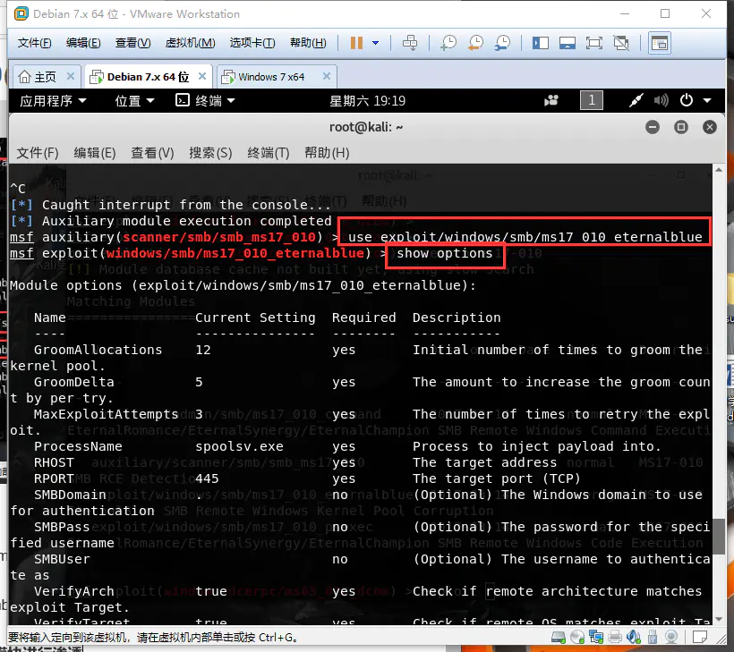

### 什么是渗透测试

渗透测试是指测试者模拟攻击者使用的漏洞技术和攻击方法，对网络目标、系统、主机、应用的安全性做出按图案探测，发现系统中脆弱的环节。渗透测试一般需要对目标系统进行主动的探测分析，发现潜在的漏洞，包括但不限于不恰当的系统配置、已知或者未知的软硬件漏洞、以及在安全计划与响应过程中的操作性弱点等，甚至暴露在开源环境下的社工信息等。

### 渗透测试的分类

针对渗透测试人员对被渗透测试目标的熟悉程度，渗透测试可以分为三种：

第一种：白盒测试，明确和熟悉被渗透测试的内部环境和技术细节，对内网的拓扑、网络结构等信息十分明确，在这种情况下进行的渗透测试就是白盒测试，在对目标进行内网加固、安全评级等工作是会使用到白盒测试。

第二种：灰盒测试，只知道目标的部分网络信息，并没有完全掌握网络内部的所有情况，例如关键部件的架构版本、所有的网络结构不被掌握下进行渗透测试。

第三种：黑盒渗透，就是对渗透测试目标的信息一无所知的情况下进行渗透测试，例如HW行动就会使用黑盒渗透测试。

### 渗透测试的流程

渗透测试执行标准(PenetrationTesting Executjion Standard),这个标准由渗透测试7个阶段的标准组成，可在任意环境中进行富有成果的渗透测试。它的官方网站详细介绍了具体测试方法，有兴趣的读者可访问 [https://www.pentest-standard.org/index.php/Main_Page](https://www.pentest-standard.org/index.php/Main_Page)。根据该标准，标准的渗透测试可以分为七个阶段，分别为;

#### 明确需求

参与渗透测试的安全人员和客户进行商定，确定渗透测试的目标，包括测试需求、测试时间、测试范围等；

#### 信息收集

通过被动扫描和主动探测、社工收集等方法，对网络目标、服务器、应用等信息进行收集，完成对渗透目标的初步了解，可以利用各种信息来源与收集技术方法，获取更多关于目标组织网络拓扑，系统配置与安全防御措施的信息。公开来源的信息查询，google hacking，社会工程学，网络踩点，扫描探测，被动监听，服务检查等；

信息收集根据分类可以分为被动收集和主动收集两种：

##### 被动收集

被动收集是指在不和网络目标中的网络设备进行连接的情况下，通过第三方网站等公开渠道进行信息收集，这样做的好处是可以保证不再目标主机留下任何痕迹的情况下进行信息收集，不会有被目标发现并被放入黑名单的风险。

###### google hacking

通过使用google搜索引擎中的高级操作符，在搜索结果中定位特定的文字操作符，以此来发现网站配置和计算机代码中的安全漏洞。常用的语法如下：

| 语法       | 描述                                                   | 示例                     |
| ---------- | ------------------------------------------------------ | ------------------------ |
| filetype   | 搜索文件的后缀名或拓展名（目前国内搜索引擎一般不支持） | filetype:php             |
| allintitle | 搜索所有关键字组成标题的网页                           | alltitle:后台登录 管理员 |
| site       | 制定搜索域名                                           | site:baidu.com           |
| intext     | 搜索网页内容包含的文字（内容包含的文字）               | intext:登录              |
| intitle    | 搜索网页标题包含的文字                                 | intitle:教务处           |
| inurl      | 搜索url中包含的文字                                    | inurl:Login              |

以上六种语法可以通过空格作为分隔符进行组合使用。并且以上语法支持以下的基本逻辑：

​	逻辑与：and &

​	逻辑或： or  ||

​	逻辑非： -

​	完整匹配："关键词" 

​	通配符：* ?

一些用例可以参考以下链接：

[https://zhuanlan.zhihu.com/p/142832509](https://zhuanlan.zhihu.com/p/142832509)

###### shodan搜索引擎

shodan是一个搜索引擎，是一个主要面向网络专业人员的现在漏洞评估工具，他和百度、谷歌一类的搜索引擎存在明显不同，shodan主要用来搜索所有接入互联网的设备，通过shodan用户可以查找带有网络地址的特定类型的设备，例如交换机、路由器、摄像头、收集、平板、工控设备、核工业设备等。

shodan与传统搜索引擎不同，它主要收集各类设备的banners信息进行审核并产生搜索结果，所谓的banners信息，实际上就是服务在查询时返回的信息块，根据响应信息的不同，Banners可以包含软件版本、安装日期、IP地址、服务类型等不同的信息快。

shodan的基本语法如下：

| 语法     | 描述                           | 示例                   |
| -------- | ------------------------------ | ---------------------- |
| net      | 搜索制定的IP地址或范围以及子网 | net:"100.100.100.0/24" |
| version  | 搜索指定的版本信息             | version:"1.8.8"        |
| city     | 搜索指定的城市                 | city:"Shanghai"        |
| country  | 搜索指定的国家                 | country:"CN"           |
| product  | 搜索指定的软件、平台、系统     | product:"Apache httpd" |
| port     | 搜索指定的端口                 | port:"22"              |
| hostname | 搜索指定的主机或域名           | hostname:"google"      |

需要特别注意的是JAWS是网络摄像头的关键字，也可以通过shodan进行搜索。此外Shodan还可以识别网络设备的类型，并且可以将部分蜜罐设备识别出来。

##### 主动收集

主动收集是安全渗透人员通过安全工具对目标设备进行主动连接，通过分析连接行为的响应信息分析网络设备的服务类型、端口开放、应用版本等信息的行为。

###### nmap工具

nmap是一种网络扫描和主机探测的网络工具，nmap不仅可以收集信息并枚举，同时还可以用来作为一个漏洞扫描器或者安全扫描器，它支持常见的所有操作系统。map的主要用途如下：

1.检测在网络中的主机(主机发现)

2.检测主机上的开发端口（端口发现或枚举）

3.检测端口的软件以及软件本（服务发现）

4.检测操作系统，硬件地址

5.检测脆弱性的漏洞(nmap的脚本)

相关细节可以参照以下两个链接:

[nmap官网](https://nmap.org/man/zh/)

[nmap中文站](http://www.nmap.com.cn/doc/manual.shtm)

#### 威胁建模

根据收集到的信息来分析和识别目标网络系统中可能存在的安全漏洞和弱点，以攻击者的视角拟定渗透测试的攻击方法；

#### 漏洞分析

根据前面收集到的信息，利用漏扫等工具探测渗透目标网络系统中的安全漏洞，确定哪些攻击方法是可行的；

##### nessus工具

Nessus号称是世界上最流行的漏洞扫描工具，据称全世界有超过75000个组织（真的有这么多吗）在使用它，它收录了不同平台和不同协议的大量安全漏洞，不随时更新其漏洞数据库。Nessus不同于传统的漏洞扫描软件，Nessus可同时在本机或远端上遥控，进行系统的漏洞分析扫描。

Nessus汇聚了每个漏洞的详细信息，这些详细信息披露了利用该漏洞的难易程度。同时Nessus显示出metasploit、core、impact和canvas等工具的利用情况。

需要额外说明的是，该工具是收费的，而且价格不菲，相关的收益也保证了该工具的更新速度和实用性。

官方使用教程文档：

[Nessus DOC](https://docs.tenable.com/Nessus.htm#Latest-Release-Notes)

##### AWVS工具

AWVS(Acunetix Acunetix Web Vulnerability Scanner)是一个自动化的web应用程序安全检测工具，该工具可以扫描任何遵循HTTP、HTTPS协议的web站点和web应用程序。AWVS可以通过网络爬虫、检查SQL注入攻击漏洞、XXS等风阀检测web应用程序的安全性。

[使用方法相关blog](https://www.cnblogs.com/iamver/p/7124718.html)

[官网文档](https://www.acunetix.com/download/fullver14/)

#### 漏洞利用

使用metasploit等工具，利用工具中发现的安全漏洞，力图获取渗透目标系统的访问权限；

##### Metasploit工具

Metasploit是渗透测试界的标准工具，可以查找、利用、验证漏洞，在这个框架下安全渗透人员可以进行一系列的渗透测试，利用现有的payload，如meterpreter等进一步获取目标信息。其中Exploit是实际发起攻击的软件组件。Auxiliary可以用来执行诸如扫描的攻击动作；payload攻击负荷是我们期望模板系统在被渗透攻击后去执行的代码。根据[相关博客](https://www.cnblogs.com/zovt/p/15530376.html#:~:text=%E4%BD%BF%E7%94%A8Metasploit%E6%A1%86%E6%9E%B6%E7%9A%84%E5%9F%BA%E6%9C%AC%E6%AD%A5%E9%AA%A4%E5%8C%85%E6%8B%AC%EF%BC%9A,1.%E6%89%AB%E6%8F%8F%E7%9B%AE%E6%A0%87%E4%B8%BB%E6%9C%BA%EF%BC%8C%E5%AF%BB%E6%89%BE%E5%8F%AF%E7%94%A8%E6%BC%8F%E6%B4%9E%202.%E9%80%89%E6%8B%A9%E5%B9%B6%E9%85%8D%E7%BD%AE%E4%B8%80%E4%B8%AA%E6%94%BB%E5%87%BB%E4%BB%A3%E7%A0%81%EF%BC%88Explolt%EF%BC%8C%E5%88%A9%E7%94%A8%E6%BC%8F%E6%B4%9E%E6%9D%A5%E8%BF%9B%E5%85%A5%E7%9B%AE%E6%A0%87%E7%B3%BB%E7%BB%9F%E7%9A%84%E4%BB%A3%E7%A0%81%EF%BC%89)的归纳，各个模块的具体功能如下表所示:

| 模块                     | 功能简介                                                     |
| ------------------------ | ------------------------------------------------------------ |
| Auxiliaries(辅助模块)    | 辅助模块不会直接在测试者和目标之间建立访问，它们只负责执行扫描，嗅探，指纹识别等相关功能以辅助渗透测试 |
| Exploit（漏洞利用模块）  | 漏洞利用是指由渗透测试者利用一个系统、应用或者服务中的安全漏洞进行的攻击行为。流行的渗透攻击技术包括缓冲区溢出、Web应用程序攻击以及利用配置错误等，其中包含攻击者或者测试人员针对系统中的漏洞而设计的各种POC验证程序，用于破坏系统安全的攻击代码，每个漏洞都有相应的攻击代码 |
| Payload（攻击载荷模块）  | 攻击载荷是我们期望目标系统在被渗透攻击之后完成实际攻击功能的代码，成功渗透目标后，用于在目标系统上运行任意命令或者执行特定代码，在Metasploit框架中可以自由的选择、传送和植入。攻击载荷也可能是简单地在目标操作系统上执行一些命令，如添加用户账号等 |
| Post（后期渗透模块）     | 后期渗透模块主要用于在取得目标系统远程控制权后，进行一些列的后期渗透攻击动作，如获取敏感信息，实施跳板攻击等 |
| Encoders（编码攻击模块） | 编码攻击模块在渗透测试中负责免杀，以防止被杀毒软件、防火墙、IDS、IPS及类似的安全软件及设备检测出来 |

其基本的使用步骤包括;

1.扫描目标主机，寻找可用漏洞
 2.选择并配置一个攻击代码（Explolt，利用漏洞来进入目标系统的代码）
 3.检查目标系统是否会被此代码影响（可选）
 4.选择并配置一个有效负载（Payload，在成功进入后在目标系统上执行的代码）
 5.选择编码方式，使入侵防御系统忽略已被编码的有效负载，即绕过杀毒软件的查杀
 6.执行攻击代码

#### 深度利用

需要渗透测试团队根据目标组织的业务经营模式，保护资产形式与安全防御计划的不同特点，自主设计出攻击目标，识别关键基础设施，并寻找客户组织最具有价值和尝试安全保护的信息资产，最终达到能够对客户组织造成最重要业务影响的攻击途径；

在这一阶段，我们关注末班系统的信息收集、提权提示以及内网横向移动。

##### meterpreter工具

meterpreter是Metasploit框架的一个拓展模块，是一种后渗透工具，在渗透攻击成功之后可以返回一个被渗透目标的控制通道。使用它可以作为作为攻击载荷能够获取目标系统的一个meterpreter shell连接。meterpreter shell作为一个渗透馍块有很多功能，可以实现对目标系统的多种控制，例如创建、修改、删除用户，捕捉键盘信息和屏幕信息、上传、下载和运行可执行文件。

#### 书面报告

这份报告体现出渗透测试流程中所有的信息，包括渗透测试执行过程，还要站在防御者角度上，帮助他们分析安全防御体系中的薄弱环节，存在的问题，以及修补与升级技术方案。

关于安全报告的书写可以参考一下blog：

[https://www.malware-traffic-analysis.net/](https://www.malware-traffic-analysis.net/)

### 渗透测试搭建

#### 攻击平台

##### KALI 

KALI集成了信息收集、漏洞评估、web应用、密码攻击、漏洞利用、网络监听、访问维护、报告工具、系统服务和无线攻击等多种工具，是渗透测试人员必备的工具系统。

[kali官网](https://www.kali.org/)

#### 靶机平台

##### phpStudy+DVWA

###### phpStudy

phpStudy是一个php调试环境的程序集成包，该集成包集成了最新的Apache、PHP、MySQL、PHPMyAdmin，一次性安装无需配置即可使用，是一个非常便捷的PHP调试环境。

[phpStudy官网](https://www.xp.cn/)

###### DVWA

DVWA（Damn Vulnerable Web Application）DVWA（Damn Vulnerable Web App）是一个基于PHP/MySql搭建的Web应用程序，旨在为安全专业人员测试自己的专业技能和工具提供合法的 环境，帮助Web开发者更好的理解Web应用安全防范的过程。

DVWA一共包含十个模块分别是：

1.Bruce Force //暴力破解

2.Command Injection //命令注入

3.CSRF //跨站请求伪造

4.File Inclusion //文件包含

5.File Upload //文件上传漏洞

6.Insecure CAPTCHA //不安全的验证

7.SQL Injection //sql注入

8.SQL Injection（Blind） //sql注入（盲注）

9.XSS（Reflected） //反射型XSS

10.XSS（Stored） //存储型XSS

同时每个模块的代码都有4种安全等级：Low、Medium、High、Impossible。通过从低难度到高难度的测试并参考代码变化可帮助学习者更快的理解漏洞的原理。
[DVWA官网](https://dvwa.co.uk/)

##### vulhub

vulhub是一个基于docker和docker-compose的漏洞环境集合，进入对应的目录可以通过执行一条命令就可以启动一个全新的漏洞环境，让漏洞复现更加简单，这样让安全研究者可以更加专注于漏洞原理本身。目前vulhub支持200左右的漏洞环境。

[vulhub的github](https://github.com/vulhub/vulhub)

##### metasploitable

metasploitable是一个特别制作的ubuntu操作系统，其设计本身是作为安全工具测试和演示常见漏洞攻击的环境。其中最重要的是可以用来作为MSF（The Metasploit Framework）攻击用的靶机。该靶机系统开放了很多高危端口如22、23、445等，并且具有很多未打补丁的高危漏洞，例如samba、MS-RPC、Shell命令注入漏洞等，而且对外开放了很多服务，允许数据外连等异常操作。

该系统中的用户口令均为弱密码，系统打在了DMA、Mutillidae等web漏洞演练平台。目前为止metasploitable3包含以下漏洞应用或服务：

| 应用或服务     | 应用或服务    | 应用或服务     | 应用或服务   |
| -------------- | ------------- | -------------- | ------------ |
| GlassFish      | Apache Struts | Tomcat         | jenkins      |
| IIS FTP        | IIS HTTP      | psexec SSH     | WinRM        |
| chinese caidao | ManageEngine  | ElasticSearch  | Apache Axis2 |
| WebDAV         | SNMP          | MySQL          | JMX          |
| WordPress      | SMB           | Remote Desktop | PHPMyAdmin   |

[metasploitable的github](https://github.com/rapid7/metasploitable3)

### 渗透测试实例-永恒之蓝

参考博客：https://www.jianshu.com/p/190186c96fc7

攻击机：kali  IP：192.168.222.153

靶机 win7  IP：192.168.222.142

#### 判断靶机是否在线

使用ping命令检测靶机是否存活


#### 查看端口开放情况

使用nmap工具对靶机进行信息收集


发现靶机开启445端口，并且是win7-win10系统，可以大胆的猜测存在‘永恒之蓝’漏洞，这一步可以使用以下命令扫描永恒之蓝漏洞是否存在：

```
nmap -p 445 --script smb-vuln-ms17-010 192.168.222.142
```


#### 启用MSF

使用search ms17-010进行搜索相关模块


```
auxiliary/scanner/smb/smb_ms17_010  #漏洞扫描模块

exploit/windows/smb/ms17_010/eternalblue #渗透模块
```


#### 使用攻击模块进行渗透

调用模块，设置需要设置的参数




#### 执行exploit进行攻击

exploit攻击时间有点长，稍微等待一下就可以


#### 获取目标的shell

渗透完成后，他会直接给你一个shell的回显，而不是meterpreter回显，因为没有设置payload


#### 设置payload获取meterpreter回显

设置payload和攻击机IP


渗透完成后得到一个meterpreter回显


#### background后台执行

使用background命令，是放在后台运行如果在需要运行，则需要使用sessions命令，sessions +id即可


输入命令shell，是进入shell交互模式


#### 获取用户的哈希

输入命令hashdump命令，将所有用户的哈希值列举出来


#### 文件下载

输入命令download命令，下载文件。download命令后面需要加  ‘文件路径’


#### 获取winscp的账号和密码

利用meterpreter获取winscp保存的用户名和密码

```
run post/windows/gather/credentials/winscp
```

