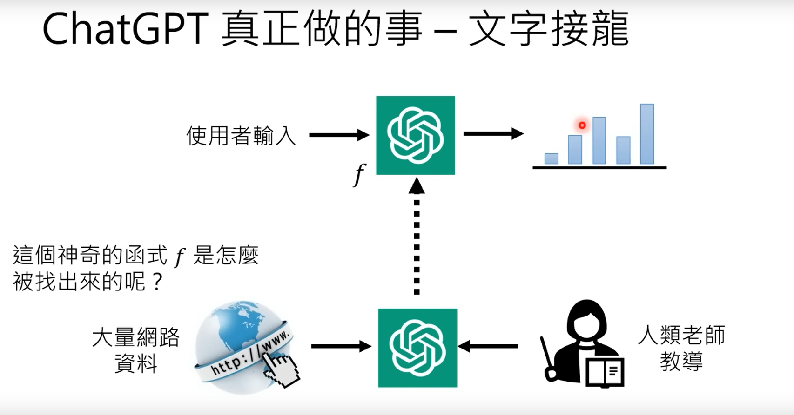
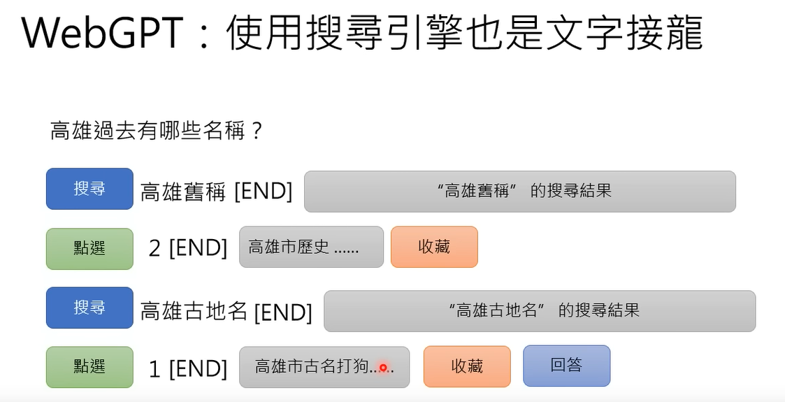
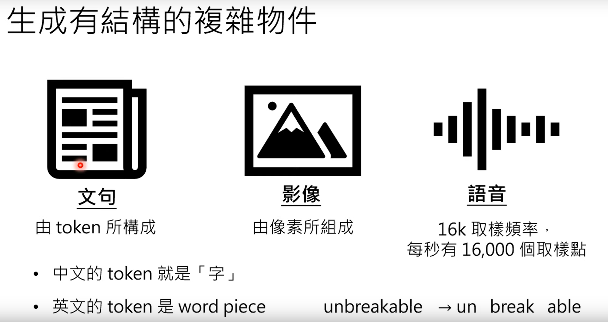
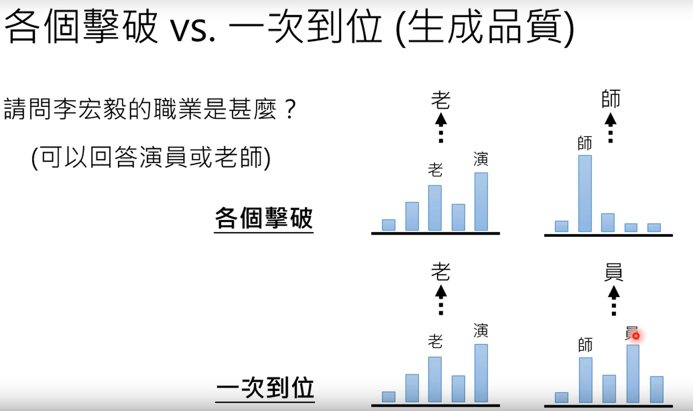
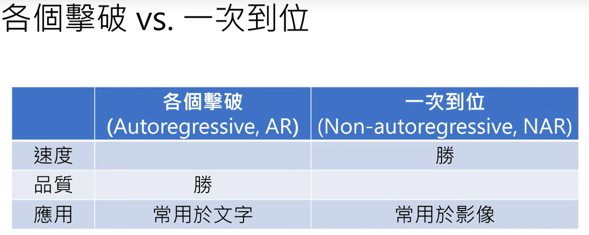

该文章主要是对李宏毅教授在youtube上的生成式AI的教学视频的学习与记录。

# 1 ChatGPT 原理剖析

### 1.1 對 ChatGPT 的常見誤解

一、ChatGPT(全名：Chat Generative Pre-trained Transformer)。chatgpt是在数据库中查询并给出的结果。这个是一个经典误解，同时chatgpt在每次被问到同一个问题时，都会回复不同的答案。

二、chatgpt是在网上抄来的，其实不是的，chatgpt可能会给出网络中从未出现的答案，同时OpenAI官方的介绍中说chatgpt是不联网的，同时chatgpt对于2021年以后的事情知之甚少。

三、chatgpt真正做的事就是文字接龙，根据问题给出回答的第一个字，这个词是所有词中输出概率最大的那一个，并在后面不断输出第二、三、四个字，最终输出问题的所有答案。

四、chatgpt是如何记录对话的历史信息的呢？这是因为chatgpt的输入不仅仅是当前的文字输入，同时还包括当前会话的历史信息，比如在当前问题之前的谈话内容等。记录历史信息需要有很好的信息记录能力，也就是说有海量的参数。

五、chagpt的训练形式，通过大量的网络资料，以及人类老师(专家系统)的教导。

### 1.2 chatgpt背后的关键技术：预训练(Pre-train):

采用监督学习的方法训练chatgpt是行不通的，因为监督学习的标注信息总是相对来说有限的，当超出监督学习的标注范围时，chatgpt就将无法应对这些问题。因此可以使用网络上的文字信息作为训练数据。

#### 1.2.1 chatgpt的之前GPT版本

| 版本  | 年份 | 数据量                      | 模型参数大小 |
| ----- | ---- | --------------------------- | ------------ |
| GPT   | 2018 | 1GB                         | 117M         |
| GPT-2 | 2019 | 40GB                        | 1542M        |
| GPT-3 | 2020 | 570GB(从45TB数据中筛选所得) | 175B         |

后续的GPT3.5是指在GPT3的基础上进行的任务处理而产生的针对性功能模型。

#### 1.2.2 chatgpt的训练过程

而chatgpt主要经过预训练模型和微调两部分组成，其中的微调就是监督学习。

预训练的好处很多，其中一个就是可以实现跨语种的模型。比如说你预训练了一个多语种的模型，同事对其中一个语言针对某一个任务进行微调，那么其他的语言未经微调，也可以完成同样的任务。

也就是说在机器的眼里，所有的语言都是一样的。

#### 1.2.3 增强式学习

### 1.3 chatgpt所带来的研究问题

1、给chatgpt一个很要的预设场景，并明确问题

2、更正chatgpt回答中的错误

3、检测是否AI生成的文字或者语音和影像

4、会不会泄露秘密

## 2 能够使用工具的AI

1、new Bing

2、WebGPT

3、Toolformer

对于为收藏的结果，并不会输出给提问者。

### 2.1 webgpt的训练过程

webgpt可以通过学习人类老师的示范过程，来学习信息检索和输出的过程。

所有webgpt的整体训练过程包括以下流程：

### 2.2 Toolformer

#### 2.2.1 如何训练

1.使用另一个语言模型来生生产资料

2.验证语言生成模型的结果

## 3 生成式学习的两种策略

3.1 生成式的内容结构

### 3.1 各个击破

### 3.2 一步到位

### 3.3 生成式学习两者的品质

通常各个击破的品质会更好。具体情况如下示例：

并对二者的总体比较结果如下：

### 3.4 二者取长补短

 二者合作使用。

## 4 Finetuning vs Prompting(微调与提示)：对于大型语言模型的不同期待衍生的两种使用方式

### 4.1 比较GPT和BERT

GPT是文字接龙，BERT是完形填空。

### 4.2 对于大型语言模型两种期待

#### 4.2.1 专才

第一是希望模型成为某一个垂直领域的专才：

利用BERT进行专才的任务，可以做一下的任务：

其中微调是指修改BERT内部的参数微调，其中加外挂实在语言模型外部再加入额外的参数，这样的方法有很好的优势，就是修改任务的时候，预研模型不需要进行修改。

#### 4.2.2 通才

第二是希望模型成为博闻强记的通才，也就是根据prompt(提示),完成更加广泛的任务：

