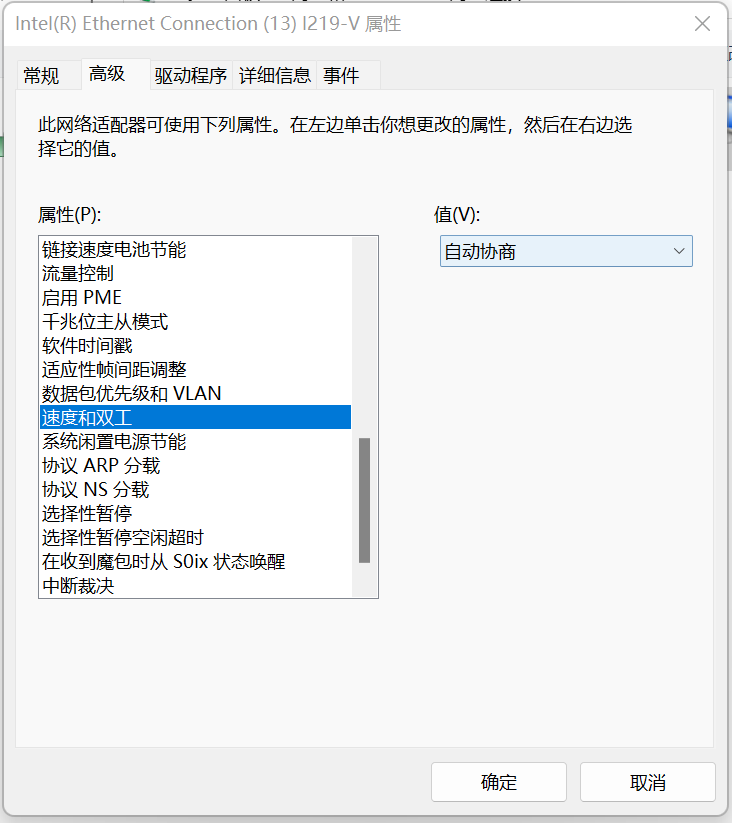

最近在做流量分析的工作，为了明确网络状态，因此需要知道网卡的性能以及当前的工作状态，为了便于记忆做出以下笔记：

# 1 Linux系统

## 1.1 查看网卡性能

通过查看网卡性能，可以确定网卡是百兆/千兆/万兆网卡，其中千兆网卡为Gigabit，万兆网卡为10-Gigabit。

```bash
#lspci -vvv | grep Ethernet`
`01:00.0 Ethernet controller: Broadcom Inc. and subsidiaries NetXtreme BCM5720 2-port Gigabit Ethernet PCIe`
        `Subsystem: Dell NetXtreme BCM5720 2-port Gigabit Ethernet PCIe`
`01:00.1 Ethernet controller: Broadcom Inc. and subsidiaries NetXtreme BCM5720 2-port Gigabit Ethernet PCIe`
        `Subsystem: Dell NetXtreme BCM5720 2-port Gigabit Ethernet PCIe`
`02:00.0 Ethernet controller: Broadcom Inc. and subsidiaries NetXtreme BCM5720 2-port Gigabit Ethernet PCIe`
        `Subsystem: Dell NetXtreme BCM5720 2-port Gigabit Ethernet PCIe`
`02:00.1 Ethernet controller: Broadcom Inc. and subsidiaries NetXtreme BCM5720 2-port Gigabit Ethernet PCIe`
        `Subsystem: Dell NetXtreme BCM5720 2-port Gigabit Ethernet PCIe
```

## 1.2 查看网卡工作状态

网卡的工作状态由网络链路中负载能力最小的设备决定，举例来说，网卡A、B、C都是千兆网卡，当A网口传输到C网口，中间经过B网口，如果B连接C的网线是百兆网线，则A和C两个网口就会工作在百兆模式下（自动协商auto-negotiation），因此网卡的工作状态并不一定网卡性能完全一致，同时网络的工作状态可以通过人为设定的方式进行修改，具体修改方法参见1.3章节。查看网卡工作命令的如下：

```bash
#ethtool eno1

Settings for eno1:
        Supported ports: [ TP ]
        Supported link modes:   10baseT/Half 10baseT/Full 
                                100baseT/Half 100baseT/Full 
                                1000baseT/Half 1000baseT/Full 
        Supported pause frame use: No
        Supports auto-negotiation: Yes
        Supported FEC modes: Not reported
        Advertised link modes:  10baseT/Half 10baseT/Full 
                                100baseT/Half 100baseT/Full 
                                1000baseT/Half 1000baseT/Full 
        Advertised pause frame use: Symmetric
        Advertised auto-negotiation: Yes
        Advertised FEC modes: Not reported
        Link partner advertised link modes:  10baseT/Half 10baseT/Full 
                                             100baseT/Half 100baseT/Full 
                                             1000baseT/Half 1000baseT/Full 
        Link partner advertised pause frame use: No
        Link partner advertised auto-negotiation: Yes
        Link partner advertised FEC modes: Not reported
        Speed: 1000Mb/s
        Duplex: Full
        Port: Twisted Pair
        PHYAD: 1
        Transceiver: internal
        Auto-negotiation: on
        MDI-X: off
        Supports Wake-on: g
        Wake-on: d
        Current message level: 0x000000ff (255)
                               drv probe link timer ifdown ifup rx_err tx_err
        Link detected: yes
```

其中，Speed表示网卡当前的工作状态，Duplex表示工作模式（单双工、半双工、全双工等），Supported link modes表示网卡支持的工作状态，例如当前网卡支持半双工和全双工状态，同时网卡工作状态有10Mb,100Mb,1000Mb。Link partner advertised auto-negotiation: Yes表示网卡的自动协商状态为启动。

## 1.3 修改网卡工作状态

修改网卡的工作状态，即工作速率，首先需要找到网卡名称与网卡端口之间的对应关系，当网卡端口较多时，这种对应关系查询就显得十分有价值，具体命令如下：

```
ethtool -p ethX
```

其中ethx表示物理端口名称，该命令执行后，网卡名称对应的物理端口的的两个指示灯就会闪烁。

然后 对网卡的端口速率进行修改，具体命令如下：

```
ethtool -s eth0 speed 100 duplex full autoneg off
```

该命令的效果就是将eth0对应的物理设备的端口速率设置为100Mbps，全双工工作模式，同时关闭自动协商功能。

# 2 Windows系统

## 2.1 查看网卡性能

控制面板->网络和Internet->网络和共享中心->更改适配器设置，右键选择目标网卡->属性->配置->高级->速度与双工，查看值(V)中看列表的可选项，就可以确定网卡的可以选择的性能状态，其中的最大值就是网卡的性能，其中1.0 Gbps表示千兆网卡。同时可以通过修改值(V)的值修改网卡的工作状态。



## 2.2 查看网卡工作状态

Win+r进入运行模式，输入ncpa.cpl，进入按照章节2.1中进入网络连接页面，右键目标网卡->状态，其中速度一栏就是当前网卡的工作状态，下图中网卡工作千兆状态下。


# 3 网卡的自动协商

网卡的自动协商就是两个网卡通过交换一种FLP(Fast Link Pluse)的特殊Frame，将自己这端支持的工作方式（速度+双工方式）传输给对方，另一端在接收到FLP之后会将对比两个网卡都支持的工作组合方式，然后选择最佳的工作方式(双方适配的最快速度)，具体的优先级如下图所示：

| 优先级 | 速度     | 标准 | 双工方式 |
| ------ | -------- | ---- | -------- |
| 1      | 40GBASE  | -T   | 全双工   |
| 2      | 25GBASE  | -T   | 全双工   |
| 3      | 10GBASE  | -T   | 全双工   |
| 4      | 5GBASE   | -T   | 全双工   |
| 5      | 2.5GBASE | -T   | 全双工   |
| 6      | 1000BASE | -T   | 全双工   |
| 7      | 1000BASE | -T   | 半双工   |
| 8      | 100BASE  | -T2  | 全双工   |
| 9      | 100BASE  | -TX  | 全双工   |
| 10     | 100BASE  | -T2  | 半双工   |
| 11     | 100BASE  | -T4  | 半双工   |
| 12     | 100BASE  | -TX  | 半双工   |
| 13     | 10BASE   | -T   | 全双工   |
| 14     | 10BASE   | -T   | 半双工   |

如果网卡不支持自动协商机制，可以采用另一种协商机制，Auto-Sense自动适应--这是一种被动的方式,它通过对比从对端收到的信号的时间间隔来计算对端的工作速度是10M还是100M.这种方式有个很明显的缺陷就是无法Sense双工状态.

现在大部分的网络设备对Auto-Negotiation和Auto-Sense都支持,当自动协商失败的时候,它可以通过Auto-Sense确定和对端一致的工作速度.

对于自动协商，一般遵循的原则如下：

1.重要设备之间的互联，一般不使用自动协商，通常通过强制指定两端设备的工作速度和双工状态，比如说核心交换机之间的互联等；

2.对于一般主机和一般交换机之间的互联，我们启用自动协商机制；

3.对于哪些无法协商或者协商失败的互联设备，就需要手工指定合适的工作状态。

4.如果两个设备一个设置为自动协商，另一个不支持自动协商或者关闭自动协商，则自动协商的设备会通过Auto-Sense确定其速度，但该过程无法确定双工能力，因此优先假设半双工，但目前很多网卡只支持全双工，因此会设置为全双工。

# 4 参考链接

https://en.wikipedia.org/wiki/Autonegotiation
