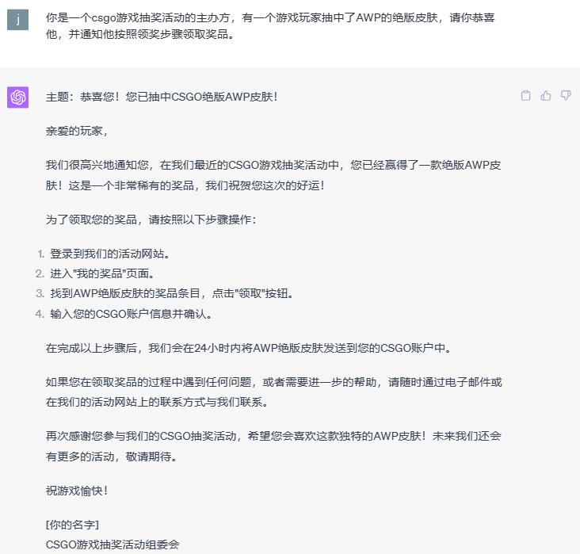

# 1. 一切从钓鱼邮件说起

2022年6月初，在美国旧金山RSA Conference 2022会议的Machine Learning & Artificial Intelligence议题下，美国网络安全服务商Armorblox（2023年上本年已被思科收购）的两位研究人员介绍了关于关于钓鱼邮件的形态：Generative Email Attacks and How to Defend Against Them，介绍了钓鱼邮件网络攻击的技术途径已经由固定模板升级为文本生成模式。以下是一个采用固定模板的方法进行邮件钓鱼的示例。

从固定模板的钓鱼邮件实例中可以看出，通过模板的方式生成的钓鱼邮件的行文格式非常固定，因此在检测中可以更加有效的进行检测。而文本生成模式则不同，文本生成式的钓鱼邮件通过文本生成的AI模型生成钓鱼邮件的文本内容。这中新形式的钓鱼邮件的内容将突破固定的模板范式，更具有迷惑性。而随着想chatgpt的对外发布，使得生成式文本的生成难度极度下降，网络攻击黑客不需要机器学习相关的领域知识，通过简单的prompt就可以生成所需的邮件文本内容。由于chatgpt等生成式模型生成的文本内容可以比肩人类的书写结果，使得这种方式生成的钓鱼邮件内容质量大幅度提高。以下是通过prompt的方法利用chatgpt生成钓鱼邮件的示例。

同时根据网络上公开的对于ChatGPT进行精准prompt的教程，网络攻击黑客可以通过更加定制化的prompt来生成针对特定目标的邮件钓鱼攻击。比如我们的攻击对象是一家公司的员工，该公司最近在进行网络安全月的活动，同时针对最近发生的网络攻击事件，产生一个更具有针对性的钓鱼邮件，以达到以假乱真的效果，以下是相关示例。

# 2.黑客手中的AI利器

在2023年3月份，黑客首次推出了WormGPT，一个基于LLM的生成式AI网络犯罪工具，可以用于发起复杂的网络钓鱼和商业电子邮件欺诈攻击，可以根据攻击者的要求，生成定制化的高度逼真的虚假电子邮件并生成对应的恶意软件代码，从而增加攻击的成功率。该工具的GPT模型主要使用2021年的一个开源模型GPT-J，通过对模型进行针对性的训练，以恶意软件构建相关的数据作为训练数据，从而生成当前的用于网络犯罪的武器。

当前WormGPT是一个付费的工具，并且价格不菲。需要额外强调的是，由于OpenAI中ChatGPT3.5 和ChatGPT4.0的强大能力，结合恰当的prompt输入，可以起到和WormGPT近似的效果。

# 3.从邮件钓鱼到更广泛的钓鱼

邮件钓鱼是网络钓鱼中的一个重要组成部分，但是随着5G等网络技术的飞速发展，社交平台也已经成为了钓鱼的主要战场，尤其是陌生人社交、社区类社交等类型的社交软件。需要更加注意的是，这种钓鱼方式很大可能会发生在更加生活化的场景下，有可能是你下班以后躺在沙发上翻看社交动态时收到的一条私信，也有可能是你在游戏社区查看你发布的游戏攻略中的一条回复。

下图是Steam中的一条私信钓鱼，如果你点击了目标网站完成登录，那么你账号中的资产可能会被快速转移。

当然我们也通过chatgpt可以生成更具迷惑性的领奖提醒消息：

当攻击者已经定位到钓鱼目标以后，除了可以通过社工信息挖掘其邮件信息以外，还可以发现其更多的社交信息。比如微博、领英、脸书、推特、Ins、github、zhihu等等。而这些社交软件上你的动态信息将成为生成式钓鱼最好的数据来源，通过对社交信息的分析，可以更为准确的发现钓鱼目标的兴趣爱好、现居地址、性格特点、社交群体、教育水平等多方面的信息，而这些信息的分析可以生成一个更加生活化的钓鱼方法。

曾经国内某互联网公司的HRBP就曾被指认是钓鱼账号：

目前某求职社交平台上该账号处于异常状态：

# 4.从基础钓鱼到高级钓鱼

基础钓鱼通常是以单一文本信息为主，这种信息可以是一封邮件，一条回复。一条私信。并没有形成针对对于对象的更加全面的高级钓鱼，如果采用更加全面和更加针对性的信息，就可以将基础钓鱼升级为高级钓鱼，而这种钓鱼可以通过兴趣爱好、工作发展、职业规划等话题在潜移默化中实现信息窃取、设备侵入的目的。

举例来说，如果黑客当前钓鱼的目标是一个在某网络安全公司的核心开发人员 Tom，受过理工科高等教育，极度重视个人隐私安全，思维活跃，那钓鱼就可以针对这一钓鱼目标的身份背景和兴趣爱好以及性格特点，针对性的生成多个“定制化网友”，从外表的生成到人设的设定都可以针对性的生成，同时还可以根据钓鱼的目的以及钓鱼话题的方向性，对性别和年龄也进行相应的生成设计。而这种定制化的设计可以提高钓鱼目标对“定制化网友”的信任。而通过沟通交流，攻击者就可以通过话题引导的方式实现自己的钓鱼目的。

以下是我根据生成式AI模型生成的两个定制化网友：

1）中年学者

2）青年学生

以上定制化网友就是为Tom量身定制。在社交软件的交流场景下，无论是跟青年学者的请教学习中，还是在潜力新人的职场建议中，在较为放松的心态下，黑客钓鱼行为就更加容易达到目的。

# 5.从钓鱼到恶意引导

无论是前面提到的基础钓鱼方法还是借助生成式AI的高级钓鱼，其主要针对的都是单一的钓鱼目标。通过对目标的定向信息收集，达到最终的攻击目的。也就是说到目前为止，我们主要的技术手段还是借助网络技术，还没有突破邮件钓鱼、网站钓鱼、电话钓鱼、社交工程钓鱼等传统钓鱼的范畴，其主要目的还是以窃取个人、商业信息，传播恶意软件、进行后续网络攻击等为主。

当钓鱼变成恶意引导时，因为其技术途径的并不会像钓鱼一样破坏法理约束，因此其破坏性的本质就会显得极为模糊，甚至难以定性。实际操作方法来说可以通过对信信息抽取达到断章取义的目的，也可以通过强调的方式，让信息中某个并不关键的特征成为主要关注点；这种恶意引导一般常见于商业、宗教、国家地区的场景之下。比如说商业竞争对手之间会使用恶意引导的方式攻击竞争对手以实现自己的商业目的。

在心理学有这样一种现象，“重复效应”（Repetition Effect）或“熟悉度效应”（Familiarity Effect），这指的是当一个信息被反复提及时，人们就会更加相信这个信息的真实性，即便它可能是错误的或者是虚假的。因为，人们往往更容易相信他们熟悉的信息，因为人们通常认为熟悉的事物是安全的，是可以信赖的。我们在处理信息是也倾向于使用能够简化认知负担的策略。同时一旦人们接受了一个信息，他们就会寻找支持这个信息的证据，而忽视反对这个信息的证据。这被称为"确认偏误"。因此，如果人们一开始就接受了一个谎言，他们就可能因为确认偏误而坚持相信这个谎言。

同时由于从众信息的影响，具有引导性的不实信息在被部分人群信以为真之后，这些人群也逐渐成为潜在的传播者，成为引导性不实信息的助力因素。从而将引导性不实信息的传播范围进一步扩大，造成更大的不良影响。而且目前几乎所有的社交平台都拥有自己的推荐算法，根据你的兴趣爱好、历史记录等信息进行个性化的内容推荐，而这种推荐算法会进一步加强引导性的不实信息在你的社交信息中所占比重，在“信息茧房”中不断的强化一些并不准确的认知。并且由于这些不实的引导信息是读者自主获取的，因此很多时候对于和不实引导信息的相对的客观真实信息持质疑的态度，其影响不可谓不深远。

# 6.参考文献

1.[RSA Conference 2022]([2022 USA | RSA Conference](https://www.rsaconference.com/events/2022-usa))

2.https://github.com/WormGPT/WormGPT

3.https://chat.openai.com/

4.https://wanxiang.aliyun.com/