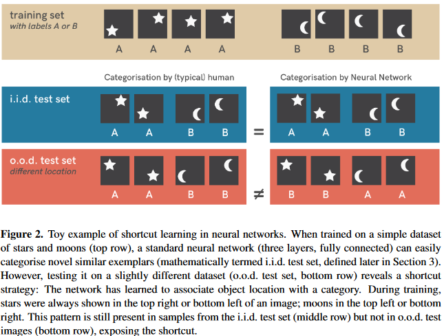

论文名称：Shortcut Learning in Deep Neural Networks

论文下载地址：[https://arxiv.org/pdf/2004.07780v3.pdf](https://arxiv.org/pdf/2004.07780v3.pdf)

黑色文字：文中观点

红色文字：笔者观点

# 1. 学习没有捷径

深度学习因为其优异的学习能力，已经成为推动人工智能发展当之无愧的主力军。深度学习在NLP和CV等不同的场景下都展现了优异的检测能力。但深度学习也存在一个与生俱来的问题：捷径学习。数学和物理等理论经过几个世纪的研究，已经形成了经得住实际情况考验并且自洽的理论体系，但是深度学习的研究与之相比恰如刚刚兴起，因此并没有形成较为完整的理论体系。很多时候深度学习的检测能力都是在一定数据集上进行检测指标的量化，这种结果导向的行为有时确实体现了模型的检测能力，但与当前使用的数据集深深绑定。很多时候我们难以判断深度学习模型学习的到底是不是知识，还是如盲人摸象、管中窥豹一般的片面偏执。

图1中的就列举了四个深度学习模型产生捷径学习的案例，即便在默写场景下深度学习模型的检测能力已经达到甚至超过了人类的水平。第一个图中模型将绿色的山坡识别为绵羊，第二个图中的模型将灰色图识别为茶壶，第三个图的模型以右上角中的医院标识信息作为判断是否肺炎的主要学习特征。第四个图中因为文本中特定位置的无关信息导致模型无法完成智能问答任务。对于这些检测错误，会引出一些更深层次的问题供研究人员思考：深度学习什么时候可以发挥作用，当模型检测失败时，我们需要知道原因，以及改进方法。

与此同时，我们知道深度学习的研究还是存于一个黑盒研究的阶段，所以深度学习存在不可解释性或不可完全解释性的问题，当深度学习检测出现错误时，这种黑盒的特性导致其很难反推失败原因，同时这种以量化指标结果为导向的特性使其不能为纠正错误提供帮助。甚至有些时候对输入数据进行细微到人眼难以发现的修改，都会导致很大程度上的影响检测结果。这种微小的修改导致模型检测结果严重失准的特点也催生了一个针对深度学习的攻击行为：对抗攻击，我更愿意将其类比成攻击者对深度学习模型的漏洞利用。

捷径学习是所有学习过程中都存在的，无论是自然生物还是深度学习模型。比如说你熟读《西游记》，所以你认为世间所有骑白马的都是唐僧，所有挑扁担的都是沙悟净。你在读《西游记》的时候总结了唐僧和沙僧的特征，并将其总结为分类的决策规则。图2是对捷径学习的一个简单示例，我们通过training set中的数据来学习知识，人类学习到的知识是图形信息：包含五角星的方块属于label A，包含月牙的方块属于label B；神经网络模型学习到的知识是位置信息：五角星或者月牙的位置在左下或右上的是label A，五角星或者月牙的位置属于左上或者右下的是label B。当在更复杂的分布外测试集的场景下，捷径学习结果就会产生错误。

捷径学习在深度学习中并不是一个新生的现象，作为原生特点，捷径学习的问题一直存在，只是在与传统机器学习方法的比较中被忽视了，并且在还没有走入工程化应用的研究阶段没有充分暴露出来。针对这种情况，研究人员对模型对应的数据分布和特征权重进行了分析，结果如图3所示。可以看出不同的数据集会训练出不同的模型，并且检测模型在整个的数据分布中有明显的局限性。并且对比了不同数据集中的特征情况，这也很好的解释了模型在新的场景下，新的测试数据集会得到糟糕的检测结果-给错误的特征以过高的权重。

如果模型学习的是信息不足的特征(uninformative features)，那么模型在训练集上的表现不会很好；如果模型学习的是过拟合的特征(overfitting features)，那么模型在训练集上表现很好，但是模型在独立同分布测试集(Independent and Identically Distributed，I.I.d)上的表现不会很好；如果模型学习的是捷径特征(shortcut features)，那么模型在分布外泛化测试集(Out-of-distribution, o.o.d)上的表现不会很好；模型只有学习了预期特征(intended features)，才能满足预期的泛化能力。

# 2. 捷径学习是如何形成的

那么捷径学习是从何而来？为了缓解捷径学习如何缓解呢？第一种就是来自捷径特征，即数据中存在捷径因素；第二个是来自判别模型，即模型对特征的权重失衡。二者在影响捷径学习的同时也在影响机器学习模型是否能脱离研究环境的重要因素。

## 2.1 数据中的捷径因素

深度学习模型在训练目标检测的过程中，如果检测目标的背景信息是单调唯一的，那么这些背景信息也会成为目标识别的重要特征。举例来说如果训练一个深度学习模型来做牛的目标检测，但是训练集中所有的牛的背景都是草原 ，换句话说训练牛的数据集的背景信息都是蓝天绿草，而不是沙滩、海水等其他背景信息。这也就会导致蓝天绿草在当前场景下很可能有很大的特征权重。这种机器学习算法问题也被叫做数据偏差（dataset biases）。即使在大数据的情况下数据的捷径因素依然存在，因为这不是数据的规模问题，而是数据产生的场景本身存在局限性。举例来说你在草原上无论拍多少张牛的照片，依然无法解决蓝天绿草的背景特征问题。这种训练数据集的有限性无法体现场景的实际数据分布，因此会产生盲人摸象的效果。                                                                                                                   

## 2.2 判别算法中的捷径因素

根据论文<ImageNet-trained CNNs are biased towards texture; increasing shape bias improves accuracy>中检测结果分析，如上图Figure 2所示。纹理特征的检测结果非常好，因此在CNN的各种卷积操作中，纹理特征获得权重也会更大，更重要的是，在端到端的训练工程中，这种纹理特征的权重是算法自己训练得出的，并非人类强加给深度学习模型的。但是这与人类视觉观察判断是不是猫存在明显不同，人眼会很重视目标的物体的外部轮廓特征，与此同时忽略了其他的重要特征信息。因此深度学习模型因为对纹理特征的较大权重，就导致对某些图片的误判，例如下面的这个猫就被识别成了大象。

在不同的场景下，这种情况存在十分普遍，如下图所示Figure 4所示，很多对于人来来说是同一类别的物体，在深度学习模型中却被分成不同类别；同时深度学习模型也会将一些风马牛不相及的物体分到同一个类别当中。

## 2.3 揭示捷径学习-概括

深度学习模型通过训练之后学到的可以是明确的模式。举例来说让深度学习模型学习分辨图片中的吉他，但是模型并不是真的理解了什么是吉他，而是概括除了吉他的一些模式(比如说吉他的外形，吉他的琴弦)，因此这种模式的概括就会存在局限性，在测试中的具体体现就是在o.o.d测试集上检测结果欠佳。

这种模式概括就可以引出捷径学习和泛化之间的内在关系，概括不是捷径学习的一部分，但是捷径学习是在模型泛化能力不足的样本案例中发现的，这种案例体现了学习过程产生的模式概括的局限。对于这个方向的研究有很多优秀的论文可以挖掘。不过我们需要明确的是，学习过程之后的模式概括失败并不是学习的失败，也不是概括行为本身的失败，而是模式概括并没有在任务的预期方向(也可以说是泛化方向)达到要求。具体模式概括在深度学习模型中的具体体现是对不同特征的所得到权重，权重低的特征就是不敏感特征，只有特征的分布发生变化后，权重能具有正确的概括能力，这样的模型才是具有泛化能力的优质模型。

# 3. 理解和诊断捷径学习

因为针对深度学习的捷径学习问题一直存在，因此针对捷径学习的研究也将持续下去，接下来我们主要介绍理解和诊断捷径学习的方法。

## 3.1 认真诠释检测结果

### 3.1.1 测试集的量化指标不等同于检测能力

捷径学习最危险的时候就是没有被发现的时候。当前机器学习的最广泛的评价标准还是对i.i.d测试集进行测试并输出量化指标。但是这些量化指标只是体现了模型在当前有限的数据下的检测结果，并不能完全度量模型的真实检测能力。

### 3.1.2 机器学习中的摩根法则

有些观点认为神经网络是模拟动物神经网络的结构，但是我们不能倾向于神经网络的训练和测试的过程就是动物大脑的学习和应用的过程，这两者之间存在明显的区别。简言之就是说，类似人类的行为并不意味着与人类相同的决策方式，在深度学习中，可以被捷径学习解释的情形就不要将其归纳为更高级的决策能力。

### 3.1.3 基准模型测试

如果想确定判断检测结果是否存在捷径学习问题，可以用基准模型进行分析-测试基准模型在不完善的特征维度下是否会得出超出预期的检测能力。如果基准模型在不完善的特征维度下检测能力极大的超出预期，则当前应用场景存在捷径学习的风险较高。以上这种情况不能用来否认深度神经网络具有更高的检测能力，但需要明确一个关键点，不能将模型在数据集上的检测表现和潜在的检测能力混为一谈。

## 3.2 如何检测捷径学习-泛化测试

### 3.2.1 将分布外测试数据作为检验标准

在评价模型的检测能力时，主要考虑模型对分布外数据的检测能力。我们还用在图片中检测牛的示例来做示例，我们在测试模型能力的时候，可以测试模型对森林中的牛、草原上的牛、河流中的牛、牛棚里的牛进行识别，来确定模型学习到的知识(模式)是针对牛本身的，而不是针对森林、草原等背景信息的。

### 3.2.2 设计一个好的泛化测试数据集

一个好的分布外泛化测试数据集要有以下的条件，第一要有明确的分布变换，这种变化可能人工都难以区分，比如不同场景下的牛。第二，良好的分布外泛化测试集应该存在让模型难以检测的样本，比如在图像处理时，可以在OOD测试集的图像中添加一些白噪声，比如被绿叶、雾气遮挡了部分肢体的牛。第三，测试数据集中可以包含训练中不包含的数据，也就是一些让模型难以检测的极具挑战的数据。以下是一些举例。

## 3.3 学习为何会想找捷径

### 3.3.1 最小努力原则

为什么机器学习这么容易造成捷径学习呢？有一个最小努力原则，就是说话的时候大家都喜欢说更小的词汇，比如用phone代替mobilephone，用plane代替airplane。学习也是一样，会用最简单最直接的特征进行学习。理论上来说深度神经网络可以拟合任何函数，归纳学习过程会产生归纳偏差，归纳偏差有下图中的四个组件决定。

### 3.3.2 理解归纳偏差的影响

机器学习的影响不仅仅依赖于数据，也会依赖机器学习算法的四个组成部分：架构、训练数据、损失函数、优化方法。通常训练过程从数据输入模型开始，这个模型包含固定的架构和随机的初始化参数，通过对比预测结果和ground truth，通过损失函数明确优化方向和预测的质量。综合这四个组成部分从算法层面明确了算法模型是否容易引捷径学习。

# 4. 如何优化捷径学习

在整个机器学习的过程中，缺乏分布外泛化的问题普遍存在。接下来会提供一些优化捷径学习的方法。

## 4.1 研究领域的先验知识

基于研究方向的先验知识，鼓励设计合理的机器学习架构和数据增强等方法避免对以外线索特征的依赖。可以通过白噪声或者切割、旋转增强检测模型在图像处检测中对无关特征的依赖，这是一种简单有效的方法。

## 4.2 对抗样本和鲁棒性

对抗性攻击时分析模型能力薄弱点的有效方法，对抗样本可以看作是一种反例，可以发现机器学习模型尚未不能解决的问题。通过对抗样本可以优化模型的泛化能力，对抗样本可以理解为模型中弱点。通过对抗样本测试模型，可以优化模型的泛化能力。

## 4.3 域适应、泛化、随机

域适应、泛化、随机等都会涉及分布外泛化的内容，通常测试集的分布应于训练过程中的数据分布应该是不同的。并且鲁棒性以及域随机也是一种非常成功的策略学习方法。

## 4.4 样本均衡

公平性研究旨在让机器学习的决策更加公平，其中包括机器学习对少数群体或者说样本较少的分类不应存在决策偏见，抛开政治正确的因素，我们可以通过样本均衡以及加权等方法解决均衡和公平的问题。

## 4.5 元学习

元学习旨在学习如何学习，其主要是通过及以往的知识经验来指导新任务的学习。其中一个阶段目标就是学习如何适应新条件的变化。这种能力与因果图(causal graphs)的识别相关。因为学习因果特征可以在改变环境时做出微小修正。

## 4.6 生成式建模和解耦

分析模型检测结果，明确数据特征与检测结果之间的关系，目标就是在通过独立的因果机制从观察中回复数据分布的真实原因，这些信息主要是通过分析模型对不同特征的权重获得的。

# 5. 结论

1.捷径学习无处不在，只能缓解不能去除。

2.应对捷径学习需要认真分析检测结果。

3.检测模型的能力，需要构建合理的分布外(OOD)测试集。

4.对模型的理解会让其更好的学习，这个理解需要包括算法架构（结构）、数据（经验）、损失函数（目标）、优化方法（学习）。